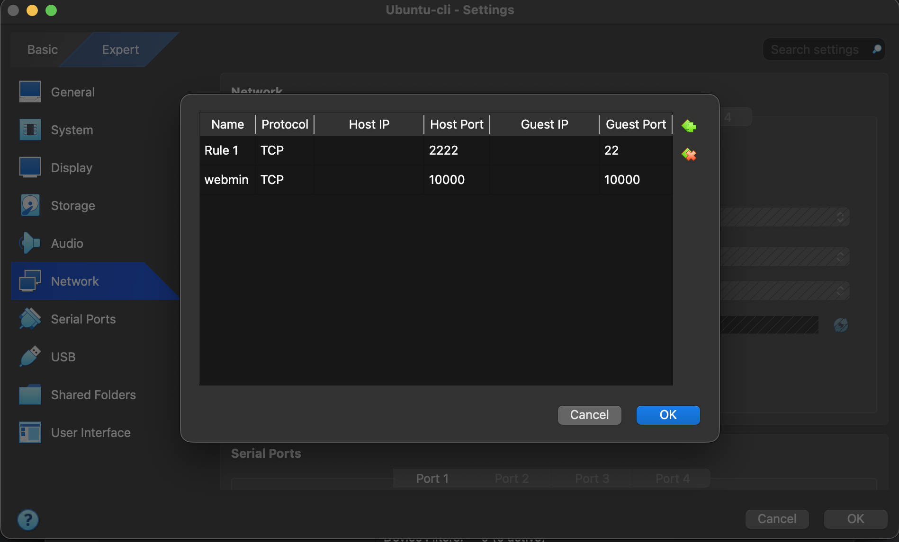
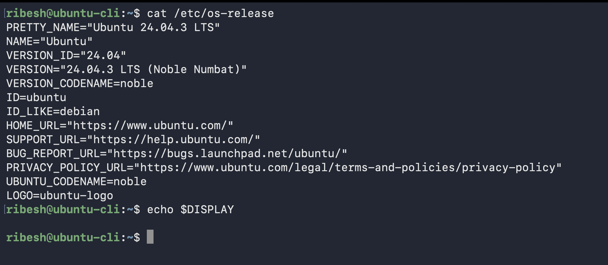
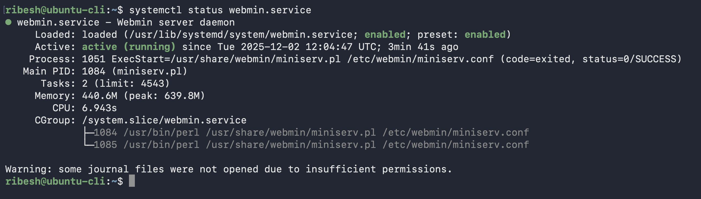
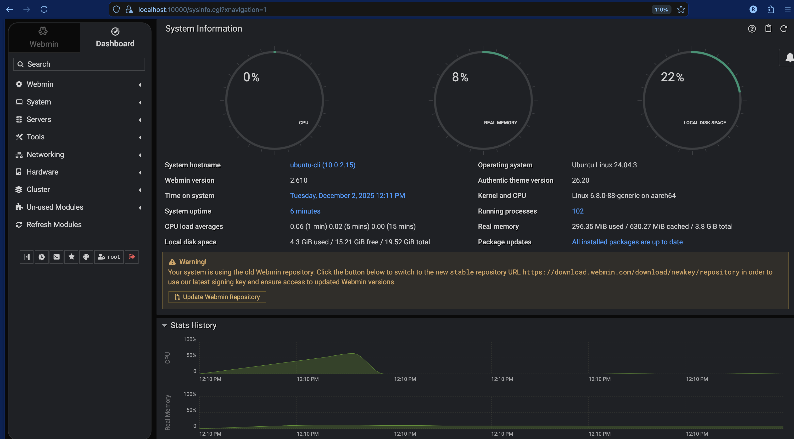

# Run Webmin on a VM with CLI based OS

## Installation
1. Download the `webmin-setup-repo.sh` and run the script
    ```bash
    curl -o webmin-setup-repo.sh https://raw.githubusercontent.com/webmin/webmin/master/webmin-setup-repo.sh

    sudo sh webmin-setup-repo.sh
    ```

2.  Install on Debian Machine
    ```bash
    sudo apt-get install webmin --install-recommends
    ```

3.  (Optional) If running in Virtual Box
    -   Enable port forwarding to map host port with guest port to access webmin
    

## Verify

1. Check the version of OS
    ```bash
    cat /etc/os-release
    ```

2. To verify if CLI or GUI 
    ```bash
    echo $DISPLAY
    ```

    -   **GUI:** The output will typically be something like `:0` or `:1`.
    -   **CLI:** The output will likely be empty.

    


3. Check the status of webmin service
    ```bash
    systemctl status webmin.service
    ```
    


4. Verify from web login
    ```bash
    https://localhost:10000
    ```
    