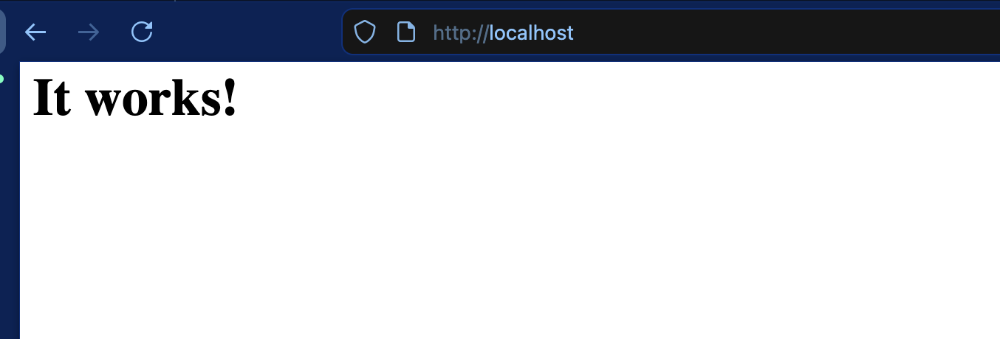
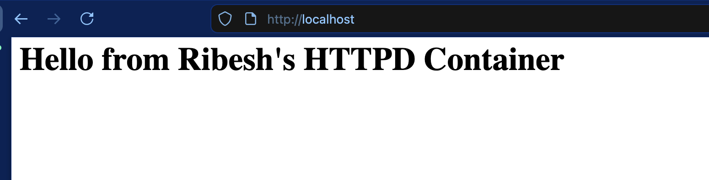

# Docker Assignment(HTTPD)

## Commands
### 1. Pull docker image
```bash
docker pull httpd:2.4
```

### 2. Run the docker image
```bash
docker run -d --name ribesh-httpd -p 80:80 httpd:2.4
```

### 3. Verify


### 4. Stop and remove the container
```bash
docker stop ribesh-httpd
docker rm ribesh-httpd
```

### 5. Make it persistent
```bash
echo "<h1> Hello from Ribesh's HTTPD Container </h1>" > index.html

cat index.html
#index.html
<h1> Hello from Ribesh's HTTPD Container </h1>

docker run -d --name ribesh-httpd -p 80:80 -v /home/ribesh/index.html:/usr/local/apache2/htdocs/index.html httpd:2.4
```

### 6. Verify
