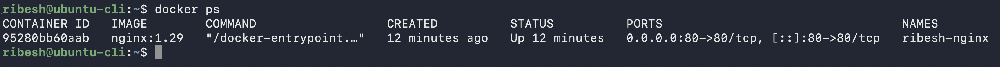
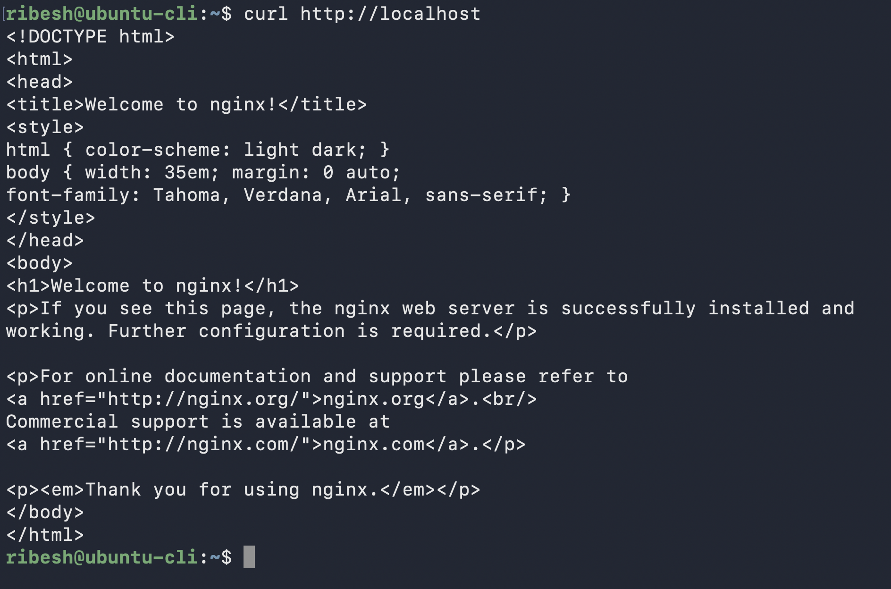
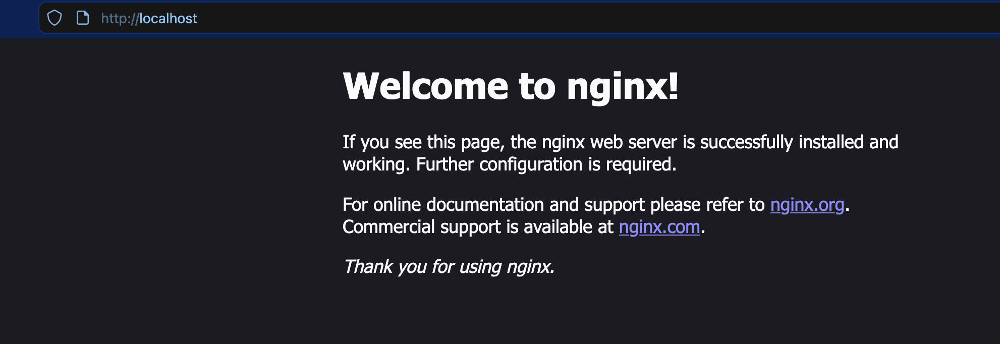
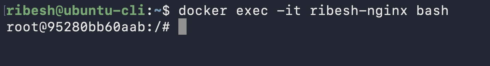
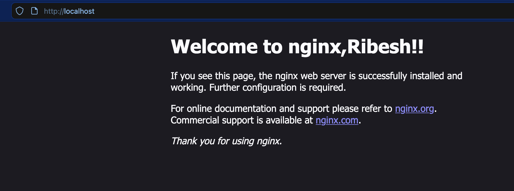
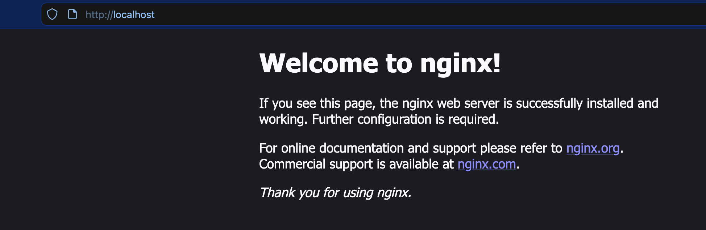
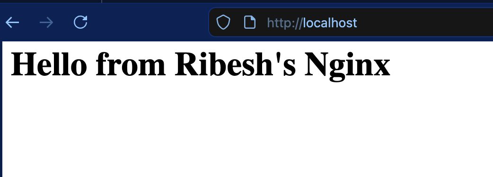

# Docker Assignment (NGINX)

-   Pull a `NGINX` or `httpd` container.
-   Browse the default page in `http://localhost`
-   Alter the default content.
-   Stop and start the container again and check if the content persists.
-   Remove the container and spin it again and check the persistence again.
-   If content does not persist, try different ways to make it persistence.


## Commands
### 1. Pull the docker image
```bash
docker pull nginx:1.29
```

### 2.  Run the image with name ribesh-nginx
```bash
docker run -d --name ribesh-nginx -p 80:80 nginx:1.29
```

### 3.  Veriy the container is running
```bash
docker ps
```


### 4.  Verify from brower or curl `(http://localhost)`
```bash
curl http://localhost
```



### 5.  Update the contents of `index.html` file by going inside container using `exec`
```bash
docker exec -it ribesh-nginx bash
```

    
#### 5.1. Go to `index.html` path and take backup
```bash
cd /usr/share/nginx/html
cp index.html index.html.back
```

#### 5.2. Since `vim` or `nano` not present using `sed` 
```bash
sed -i 's/nginx!/nginx,Ribesh!!/g' index.html
```

#### 5.3. Verify the changes
```bash
cat index.html

#index.html
<!DOCTYPE html>
<html>
<head>
<title>Welcome to nginx,Ribesh!!</title>
<style>
html { color-scheme: light dark; }
body { width: 35em; margin: 0 auto;
font-family: Tahoma, Verdana, Arial, sans-serif; }
</style>
</head>
<body>
<h1>Welcome to nginx,Ribesh!!</h1>
<p>If you see this page, the nginx web server is successfully installed and
    working. Further configuration is required.</p>

<p>For online documentation and support please refer to
<a href="http://nginx.org/">nginx.org</a>.<br/>
Commercial support is available at
<a href="http://nginx.com/">nginx.com</a>.</p>

<p><em>Thank you for using nginx.</em></p>
</body>
</html>
```

#### 5.4. Verify from browser or using curl command



### 6.  Check for persistence after restarting a container
```bash
docker restart ribesh-nginx
```


>The data still persists

### 7.  Remove the container and spin it again and check the persistence again
```bash
docker stop ribesh-nginx
docker rm ribesh-nginx

docker run -d --name ribesh-nginx -p 80:80 nginx:1.29
```

#### 7.1 Verify


> Data not persisted


### 8. Use **persistent volumes** or **bind mounts** for persistence

#### 8.1 Create the index.html file
```bash
cd ~
echo "<h1> Hello from Ribesh's Nginx </h1>" > index.html
```
    
#### 8.2 Using bind mounts to mount `index.html` to container's `index.html`
```bash
docker run -d --name ribesh-nginx -p 80:80 -v /home/ribesh/index.html:/usr/share/nginx/html/index.html nginx:1.29
```

#### 8.3 Verify


> When you remove the container the `index.html` file still persists locally, which can be used to spin new container with same configurations.