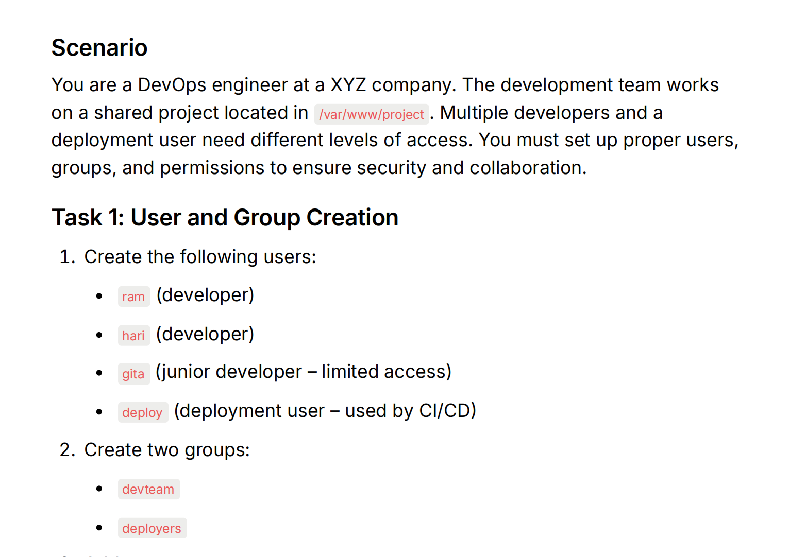
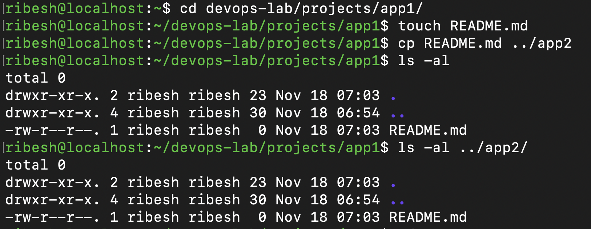
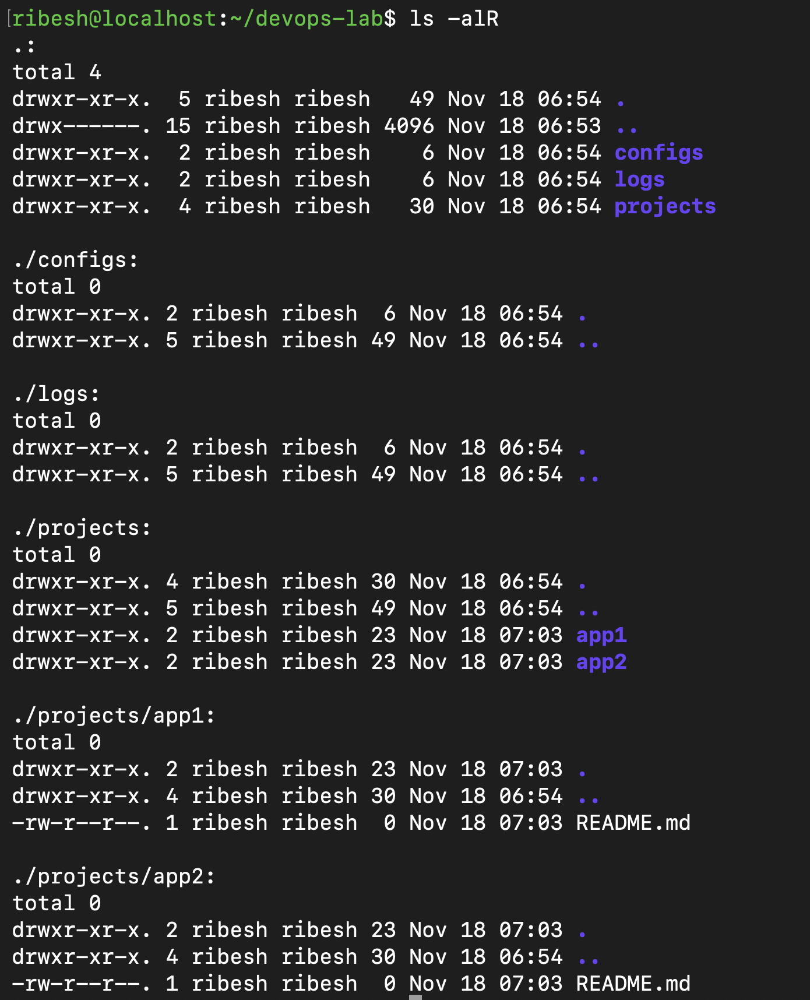

## Part 1: Linux Command Line Basics
####  Using a Linux terminal (VM, WSL, or cloud instance):


1. Create the following directory structure:
    ```bash 
    ~/devops-lab/
        - projects/
            - app1/
            - app2/
        — configs/
        - logs/
    ```
-   Commands:
    ```bash
    mkdir -p devops-lab/projects/app1
    mkdir -p devops-lab/projects/app2
    mkdir devops-lab/configs
    mkdir devops-lab/logs

    tree devops-lab/
    ```
    Output:
    

---

2. Navigate to `~/devops-lab/projects/app1/`and create a file called `README.md`
3.  Copy `README. md` to `app2/` directory
-   Commands:
    ```bash
    cd devops-lab/projects/app1
    touch README.md
    cp README.md ../app2
    ```

    Output:
    
---

4.  List all files in `~/devops-lab/` recursively showing hidden files
-   Commmands:
    ```bash
    ls -alR
    ```
    
---

