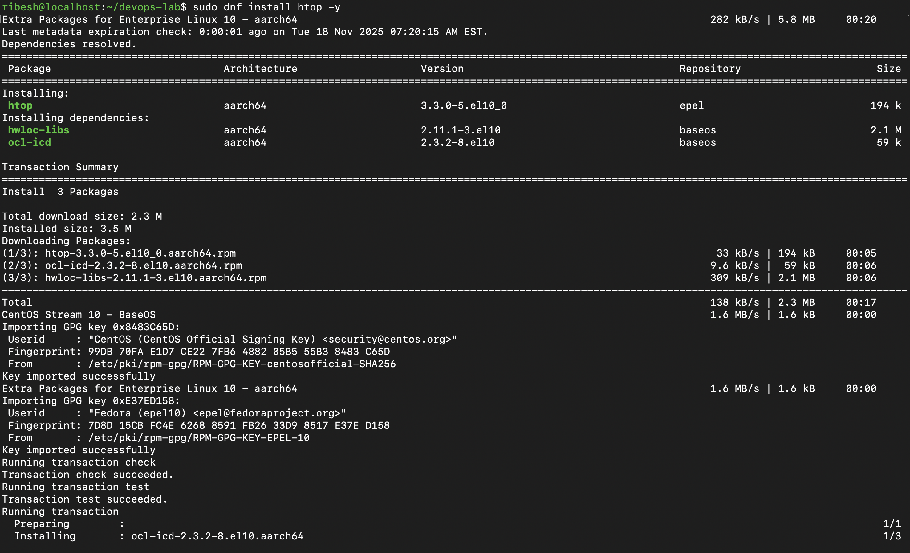
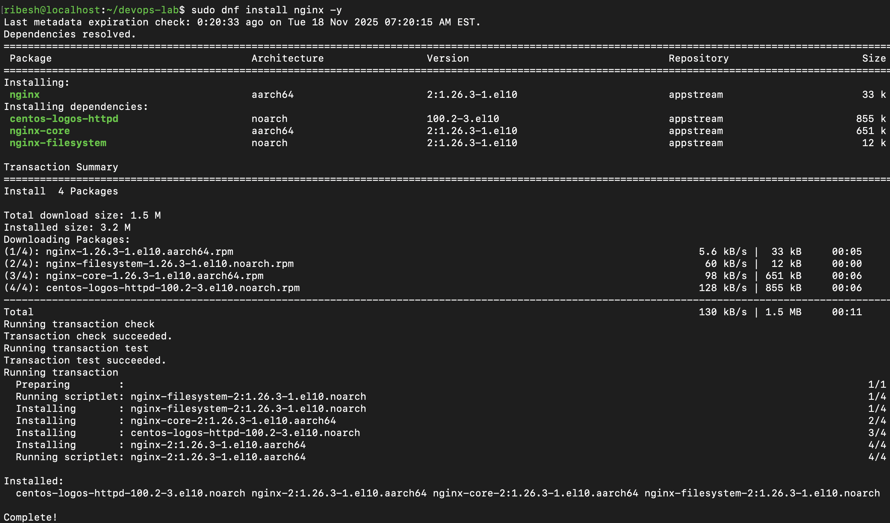
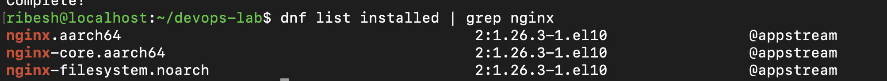
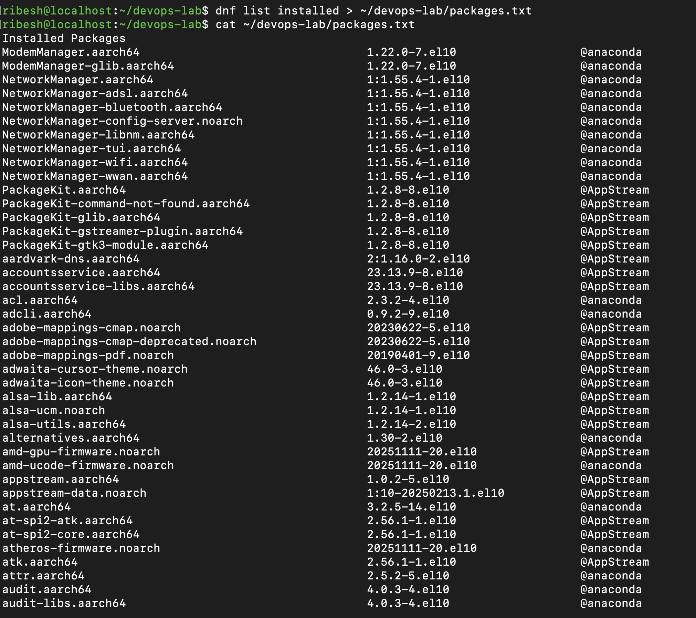

## Task2: Package Management

1. Update your package index
    ```bash
    sudo dnf install epel-release -y
    ```
    Output:
    

2. Install htop (system monitoring tool)
    ```bash
    sudo dnf install htop -y
    ```
    Output:
    

3. Check if nginx is installed. If not, list the command you would use to install it (DON'T actually install if you don't have sudo)
    ```bash
    sudo dnf install nginx -y
    dnf list installed | grep nginx
    ```
    Output:
    
    

4. List all currently installed packages and save the output to ~/devops-lab/packages.txt
    ```bash
    dnf list intalled > ~/devops-lab/packages.txt
    cat ~/devops-lab/packages.txt
    ```
    Output:
    