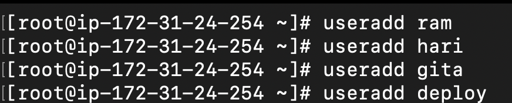
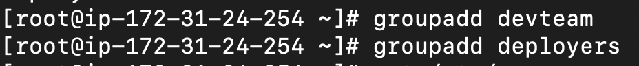
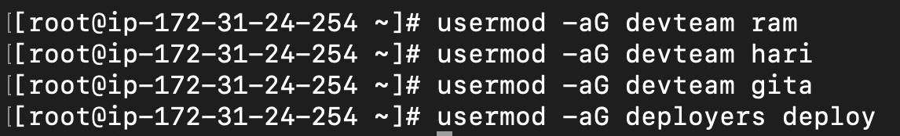

# Task 1: User and Group Creation
1. Create the following users:
    -   `ram` (developer)
    -   `hari` (developer)
    -   `gita` (junior developer – limited access)
    -   `deploy` (deployment user – used by CI/CD)

2. Create two groups:
    -   `devteam`
    -   `deployers`

3. Add users to groups:
    -   `ram` and `hari` → members of `devteam`
    -   `gita` → member of `devteam` but with restricted write access later
    -   `deploy` → member of `deployers`


# Output and Screenshots:
1. Command
    ```bash
    useradd ram
    useradd hari
    useradd gita
    useradd deploy

    passwd ram
    passwd hari
    passwd gita
    passwd deploy
    ```

    Output:
    

---

2. Command
    ```bash
    
    groupadd devteam
    groupadd deployers
    ```

    Output:
   

---

3. Command
    ```bash
    usermod -aG devteam ram
    usermod -aG devteam hari
    usermod -aG devteam gita
    usermod -aG deployers deploy
    ```

    Output:
    

---
4. Command
    ```bash
    id ram
    id hari
    id gita
    id deploy
    ```

    Output:
    