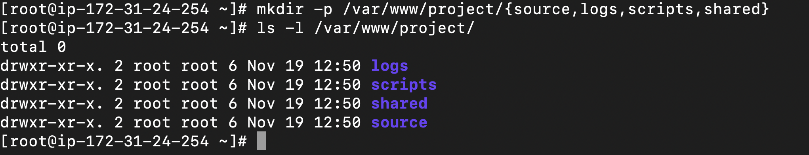
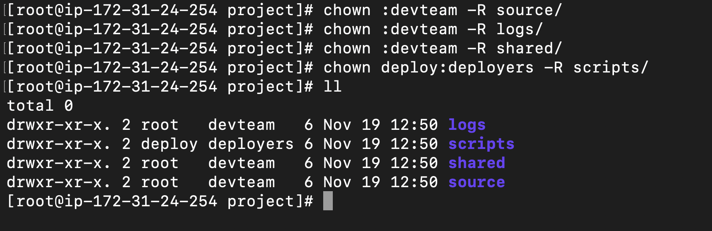

# Task 2: Directory and File Setup
1. Create the project directory:
    ```bash
    sudo mkdir -p /var/www/project
    ```
2. Inside `/var/www/project` , create:
    -   `source/ `(source code – only devteam can read/write)
    -   `logs/` (logs – everyone in devteam can append, but not delete others’
files)
    -   `scripts/` (deployment scripts – only deploy user can execute some
scripts)
    -  ` shared/` (shared assets – all devteam can read/write, new files inherit
group)


# Output

1. Command
    ```bash
    mkdir -p /var/www/project
    
    mkdir -p /var/www/project/{source,logs,scripts,shared}

    ls -l /var/www/project
    ```

    Output:
    
---

2. Command
    ```bash
    chown :devteam -R source/
    chown :devteam -R logs/
    chown :devteam -R shared/
    chown deploy:deployers -R scripts/
    ```
    Output:
    