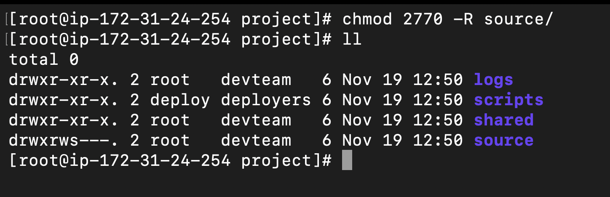
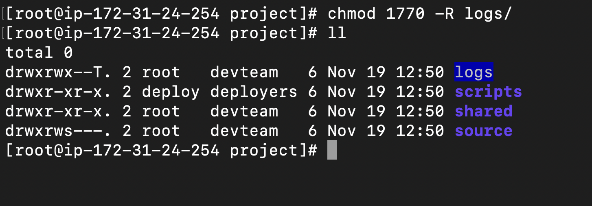
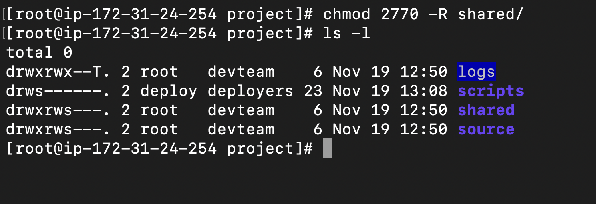

# Task 3: Apply Correct Permissions
1. Set permissions so that:
    -   Only members of `devteam` can enter and modify `/var/www/project/source/`
    -   The directory should have correct **group ownership** and **SGID** so new
files inherit the group.
    -   Default umask for `devteam` members should be `002` (rwxrwxr-x for dirs,
rw-rw-r-- for files)

2. For `/var/www/project/logs/`:
    -   Everyone in `devteam` can append to logs
    -   No one can delete or modify others’ log files → use **sticky bit**

3. For `/var/www/project/scripts/deploy.sh` :
    -   Only the `deploy` user should be able to execute it
    -   Use **SUID** so it runs with owner privileges (assume owner is root or
deploy)

4. For `/var/www/project/shared/` :
    -   All `devteam` members can read and write
    -   Use **setgid** so all new files created belong to `devteam` group
automatically
---

# Output:

1. Command
    ```bash
   chmod 2770 -R source/
    ```

    Output:
    ```bash
    [root@ip-172-31-24-254 project]# ll
    total 0
    drwxr-xr-x. 2 root   devteam   6 Nov 19 12:50 logs
    drwxr-xr-x. 2 deploy deployers 6 Nov 19 12:50 scripts
    drwxr-xr-x. 2 root   devteam   6 Nov 19 12:50 shared
    drwxrws---. 2 root   devteam   6 Nov 19 12:50 source
    ```
   

---

2. Command
    ```bash
    chmod 1770 -R logs/
    ```

    
    Output:
    ```bash
    [root@ip-172-31-24-254 project]# ll
    total 0
    drwxrwx--T. 2 root   devteam   6 Nov 19 12:50 logs
    drwxr-xr-x. 2 deploy deployers 6 Nov 19 12:50 scripts
    drwxr-xr-x. 2 root   devteam   6 Nov 19 12:50 shared
    drwxrws---. 2 root   devteam   6 Nov 19 12:50 source
    ```
    

3. Command
    ```bash
    vi scripts/deploy.sh

    chown deploy:deployers -R scripts/deploy.sh
    chmod 4700 -R scripts/deploy.sh
    ```

    Output:
    

4. Command
    ```bash
    chmod 2770 -R shared/
    ```

    Output:
    