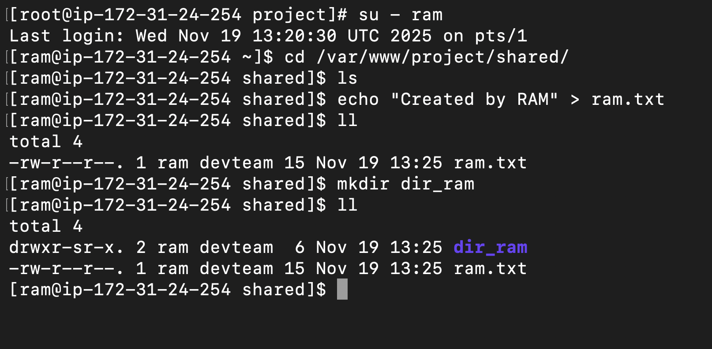
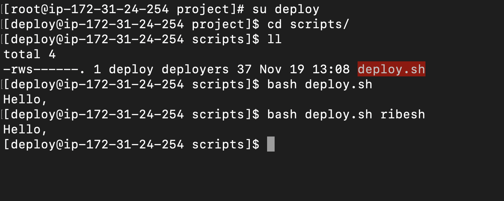

# 5: Verification & Testing
1. As user `ram` , create a file in `shared/` and verify:
    -   Group ownership is `devteam`

    -   Permissions are `664` (or `775` for directories)

2. As user `gita` , try to delete a file created by `ram` in `logs/` → should fail due to
sticky bit.

3. As user `deploy` , execute the `deploy.sh` script successfully even if not owner.

# Output:

1. Command
    ```bash
    su ram

    echo "Created by RAM" > ram.txt
    mkdir dir_ram
    ```

    Output:
    

---


2. Command
    ```bash
    su ram
    cd logs
    touch ram.log
    exit

    su gita
    cd logs
    rm ram.log
    ```

    Output:
    


3. Command
    ```bash
    su deploy
    cd script
    bash deploy.sh
    ```

    Output:
    