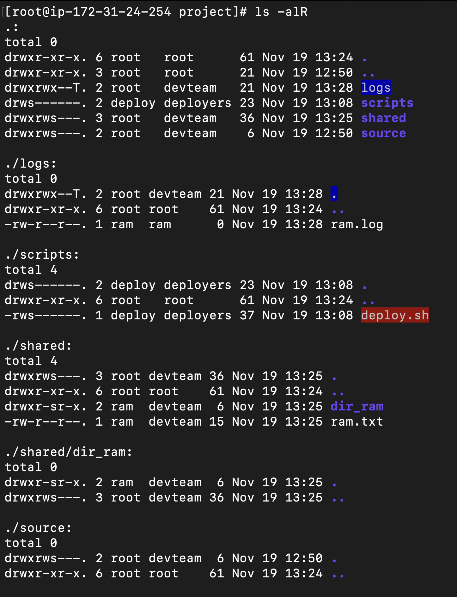

# Task 6: Documentation (Mandatory)
Write a markdown report including:
    
-   All commands you used
-   Screenshot or output of:

    ```bash
    ls -la /var/www/project/ (and subdirs)
    id ram, hari, gita, deploy
    getfacl (if you used ACLs – bonus)
    ```

-   Explanation of why you used SUID/SGID/Sticky bit
-   Security implications of your setup


# Output:
## All Commands used:

```bash
useradd ram
useradd hari
useradd gita
useradd deploy

passwd ram
passwd hari
passwd gita
passwd deploy

groupadd devteam
groupadd deployers

usermod -aG devteam ram
usermod -aG devteam hari
usermod -aG devteam gita
usermod -aG deployers deploy

id ram
id hari
id gita
id deploy
```

```bash
mkdir -p /var/www/project    
mkdir -p /var/www/project/{source,logs,scripts,shared}
ls -l /var/www/project

chown :devteam -R source/
chown :devteam -R logs/
chown :devteam -R shared/
chown deploy:deployers -R scripts/

```

```bash
chmod 2770 -R source/

chmod 1770 -R logs/

vi scripts/deploy.sh

chown deploy:deployers -R scripts/deploy.sh
chmod 4700 -R scripts/deploy.sh

chmod 2770 -R shared/
```

```bash
su ram

echo "Created by RAM" > ram.txt
mkdir dir_ram

su ram
cd logs
touch ram.log
exit

su gita
cd logs
rm ram.log

 su deploy
    cd script
    bash deploy.sh
```

# Screenshot:


```bash
[root@ip-172-31-24-254 project]# id ram
uid=1001(ram) gid=1001(ram) groups=1001(ram),1005(devteam)
[root@ip-172-31-24-254 project]# id hari
uid=1002(hari) gid=1002(hari) groups=1002(hari),1005(devteam)
[root@ip-172-31-24-254 project]# id gita
uid=1003(gita) gid=1003(gita) groups=1003(gita),1005(devteam)
[root@ip-172-31-24-254 project]# id deploy
uid=1004(deploy) gid=1004(deploy) groups=1004(deploy),1006(deployers)
```


# Why SUID, SGID, and Sticky Bit?
- **SUID [4] (Set User ID)** on `deploy.sh`:
    -   Ensures the script runs with the owner’s privileges (user `deploy`).
    -   Useful so CI/CD or automated processes run with consistent permissions.
    -   Misuse of SUID (especially with root) can be a security risk if scripts are not carefully written and validated.

-   **SGID [2] (Set Group ID)** on `source/` and `shared/`:
    -   Forces all newly created files/directories to inherit group `devteam`.
    -   Simplifies collaboration because everyone in `devteam` automatically shares group ownership and group permissions.

-   **Sticky bit [1]** on `logs/`:
    -   Prevents users from deleting or renaming files owned by others in that directory.
    -   Protects log files from being removed by other developers, while still allowing them to create their own logs.

# Security Implications
-   **Least privilege:**
    -   Only `devteam` has access to `source/` and `shared/` while others are blocked.
    -   `deploy.sh` is executable only by the `deploy` user, minimizing exposure.
-   **SUID risks:**
    -   If `deploy.sh` contained insecure commands or allowed arbitrary command execution, an attacker could abuse the elevated permissions.
    -   Scripts with **SUID** should be thoroughly audited, avoid using user input unsafely, and be kept as simple as possible.
-   **SGID & group sharing:**
    -   Makes collaboration easier but means any `devteam` member can modify `devteam` files.
    -   For more granular control, `ACLs` can restrict individual users.

-   **Sticky logs:**
    -   Prevents users from deleting each other’s log files, preserving audit/history.
    -   Users can still modify their own log files, so critical logs should also be protected (e.g., root-owned, append-only).