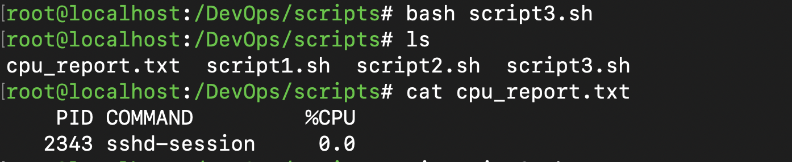

# Run Script

```bash
root@localhost:/DevOps/scripts# bash script3.sh 
root@localhost:/DevOps/scripts# ls
cpu_report.txt  script1.sh  script2.sh  script3.sh
root@localhost:/DevOps/scripts# cat cpu_report.txt 
    PID COMMAND         %CPU
   2343 sshd-session     0.0
```

Output:


