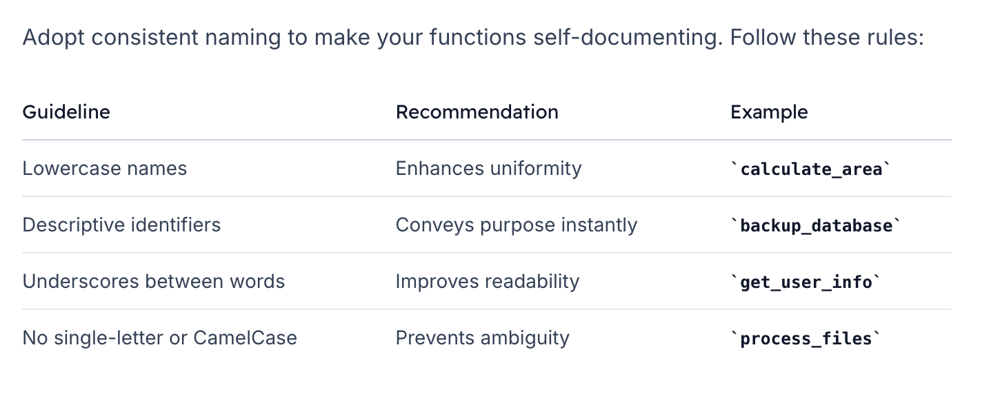

# Functions
## Overview
> Functions are essential for writing clean, modular shell scripts. They help you:

- Reuse code and avoid duplication
- Improve readability and maintainability
- Handle complex tasks in a structured way

## Naming Conventions


## Defining a Function
```bash
function_name() {
    # function body
}
```

### Key style guidelines:

1. Include parentheses `()` after the name.
2. Place the opening brace `{ `on the same line, preceded by one space.
3. Align the closing brace `}` with the function declaration (no extra indentation).


### Example
```bash
calculate_area() {
    local radius=$1
    echo "Area: $(( 3 * radius * radius ))"
}


get_name() {
    local user_id=$1
    # Retrieve the user’s name from a data source
    echo "User Name for ID $user_id"
}

clone_repo() {
    local repo_url=$1
    git clone "$repo_url"
}
```
