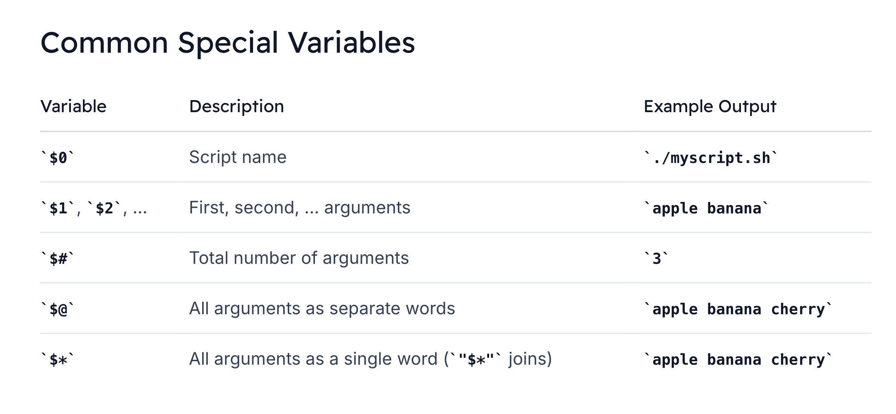

# Command Line Arguments 

> Command-line arguments are essential in shell scripting for creating flexible, reusable scripts. **Instead of hard-coding values, you can accept inputs at runtime—much like using a remote control to switch channels on a TV.** This guide covers everything from basic positional parameters to advanced iteration techniques.

# Understanding Positional Parameters
```bash
./myscript.sh foo bar baz

#!/bin/bash
echo "First argument: $1"
echo "Second argument: $2"
echo "Third argument: $3"
```

Output:
```bash
First argument: foo
Second argument: bar
Third argument: baz
```


## Practical Example: Cloning and Counting Files
Suppose you need to clone a Git repository and count its files. A hard-coded approach looks like this:

```bash
#!/bin/bash
git clone https://Ribesh@github.com/Ribesh/DevOps-Bootcamp.git
find . -type f | wc -l
```

## Parameterizing Your Script
```bash
#!/bin/bash

# Clone the repository passed as the first argument
git clone "$1"

# Count files in the cloned repo
find . -type f | wc -l
```



### Example

```bash
#!/bin/bash
echo "Script name: $0"
echo "Number of arguments: $#"
echo "All arguments (\$@): $@"
```

```bash
./myscript.sh apple banana cherry

#Output:
Script name: ./myscript.sh
Number of arguments: 3
All arguments ($@): apple banana cherry
```

## Iterating with Shift
The `shift` command discards `$1` and **shifts** all other parameters down by one. 
  >This is useful when you don’t know the number of arguments in advance:

```bash
#!/bin/bash

# Loop through all arguments
while [ $# -gt 0 ]; do
  echo "Current argument: $1"
  shift
done
```

```bash
./shift-example.sh arg1 arg2 arg3
Current argument: arg1
Current argument: arg2
Current argument: arg3
```

---

```bash
#!/bin/bash
project=${1}
branch=${2}
project_dir="$(basename ${project} .git)"

clone_project() {
  if [ ! -d "/home/bob/git/${project_dir}" ]; then
    cd /home/bob/git/
    git clone ${project}
  fi
}


git_checkout() {
    cd "${project_dir}"
    git checkout "${branch}"
} 

find_files() {
  find . -type f | wc -l
}
clone_project
git_checkout
find_files
```