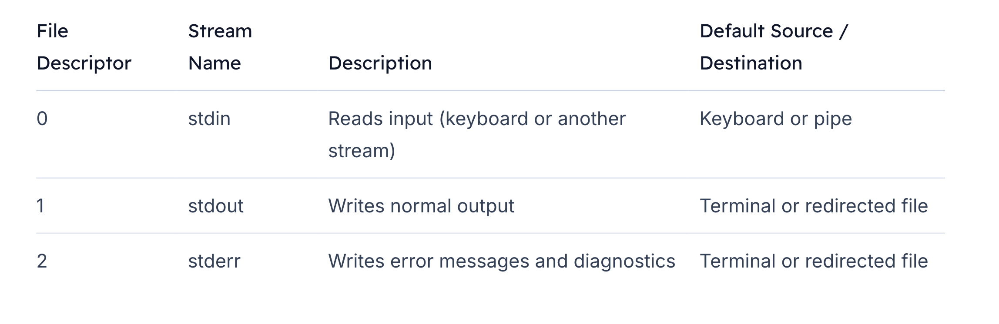
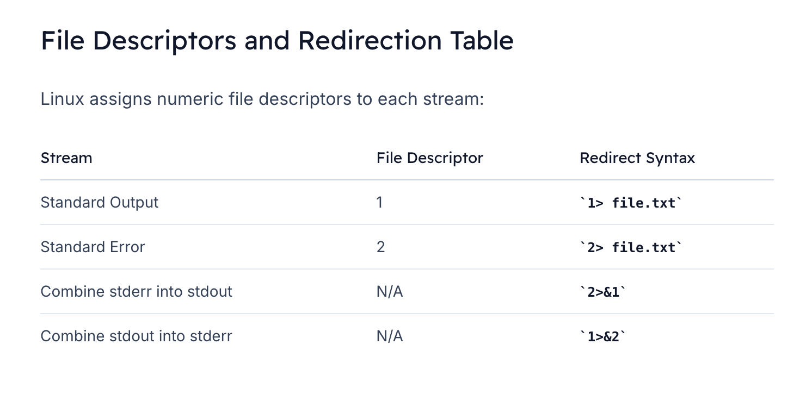
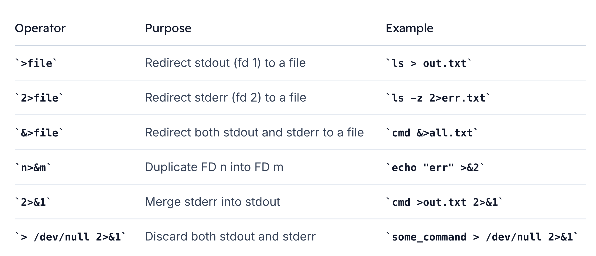

# Steams
## Overview

We will learn how to manipulate **streams** in shell scripting. 
>Linux streams are the flow of data between processes—much like water flowing through a pipe. 

Just as you can redirect a river with gates, you can reroute streams in the shell using redirection operators and pipes.

>Understanding **streams** is essential for robust shell scripts. You’ll see how to capture `command output`, `handle errors`, and `chain commands` with `pipes` to build powerful one-liners.

## Standard Streams in Linux



-   `Standard input (fd 0)` typically reads from your keyboard
-   `Standard output (fd 1)` displays command results
-   `Standard error (fd 2)` sends error messages

> **Note:**
`stdout` and `stderr` both default to your terminal. Redirecting one does not affect the other unless you explicitly combine them.

> Think of them as two separate pipes under your sink: clean water `(stdout)` versus wastewater `(stderr)`. Keeping them distinct helps you handle success and failure conditions independently.


## Redirecting Streams
You can reroute streams using `<`, `>`, and `pipes (|)`. 
-   This allows you to **save output to files**, **read input from files**, or **chain commands together**.

```bash
# Redirect stdout to a file
grep "error" logfile.txt > results.txt


# Redirect stderr to a file
gcc program.c 2> compile_errors.log


# Send both stdout and stderr to the same file
./run_tests.sh > all_output.log 2>&1


# Read stdin from a file
sort < unsorted_list.txt


# Pipe stdout of one command into stdin of another
ps aux | grep sshd
```

> **Warning:**
When combining redirections, order matters. Always place `2>&1` after `>` file to capture both streams.

### Examples
1. Capture command output and errors separately:
    ```bash
    ls -l /some/path > listing.txt 2> errors.txt
    ```

2.  Chain commands using pipes to filter data:
    ```bash
    cat server.log | grep "WARN" | sort | uniq -c
    ```

3.  Use input redirection to feed a script:
    ```bash
    bash < setup_script.sh
    ```


## File descriptors
> On the command line, the numbers `1` and `2` refer to `standard output` and `standard error`—these are examples of file descriptors. 



---
#### Real-World Analogy: Librarian and Call Numbers
Imagine a library where:

-   The *librarian* is your **operating system**
-   *Books* are **files, sockets, or pipes**
-   *Call numbers* on the books are **file descriptors**

#### Standard Streams Mapped to Descriptors
Applying the library analogy to standard streams:

-   stdin (0): Asking the *librarian* which book you want
-   stdout (1): Receiving the *book* from the *librarian*
-   stderr (2): Getting an error message if the book is unavailable

### Separating Both Streams
1. To send stdout and stderr to different files:
    ```bash
    # stdout → stdout.txt; stderr → stderr.txt
    ls -z > stdout.txt 2> stderr.txt


    cat stderr.txt
    # ls: invalid option -- 'z'
    cat stdout.txt
    # (empty)
    ```

2. Or, when a command succeeds:
    ```bash
    # List directory normally; redirect streams anyway
    ls > stdout.txt 2> stderr.txt
    # stdout.txt now has the listing; stderr.txt is empty
    ```

### Combining Streams
Merge stderr into stdout, writing both to the same file or pipe:

```bash
# Send both stdout and stderr to combined.log
my-command > combined.log 2>&1


# Or merge them into a pipeline
my-command 2>&1 | grep "pattern"
```

> **Overwriting Caution:**
Using `>`will overwrite existing files. To avoid data loss, double-check your redirections or use `>>` to append.


## dev/null
> Redirecting standard error `(stderr)` into standard output `(stdout)` is a powerful shell idiom that helps you capture or suppress all command output in one place.

### 1. Basic redirection with `>`
```bash
$ ls > stdout.txt
```

You can explicitly specify the FD:
```bash
$ ls 1>stdout.txt    # same as `ls > stdout.txt`
$ ls 2>stderr.txt    # redirect stderr (fd 2) into stderr.txt
```


### 2. Merging stdout and stderr with `&>`
```bash
$ ls -z &> all-logs.txt
$ cat all-logs.txt
ls: cannot access '-z': No such file or directory
```

>Here, `&>` is equivalent to `>file 2>&1` in Bash.


### 3. Duplicating file descriptors using `>&n`
When `&` appears on the right side of `>`, you’re duplicating an FD instead of writing to a filename:

```bash
$ echo "warning" >&2    # send stdout (fd 1) into stderr (fd 2)
```

>This is different from `&> file.txt`, which writes both stdout and stderr into a file.

### 4. Swapping streams with n>&m
A. Send stdout into stderr:
-   ```bash
    $ echo "warning" >&2
    ```

B. Send stderr into stdout:
-   ```bash
    $ ls -z 2>&1
    ls: cannot access '-z': No such file or directory
    ```

### 5. Redirecting both streams to a file
```bash
$ ls -z > file.txt 2>&1
```

### 6. Discarding all output with /dev/null
```bash
> /dev/null 2>&1
```

## Key Takeaways


```bash
find / -type f -name "question8_directory" 2> /dev/null

#Output:
/etc/question8_directory
```