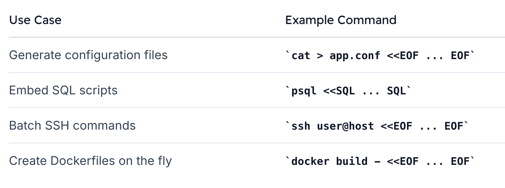

# Heredocs
> **Heredocs** let you include *multi-line text* or *commands* 
directly within a Bash script, avoiding repetitive `echo` statements and manual editing.

They’re invaluable for 
1. Generating configuration files, 
2. Embedding SQL queries, or 
3. Executing batches of commands over SSH—**especially in non-interactive environments where editors like Vim or Nano aren’t available.**


## Why Choose Heredocs Over Multiple echo Commands
Using individual `echo` lines quickly becomes **error-prone** as your script grows:

```bash
echo "line1" > file.txt   # creates or overwrites file.txt
echo "line2" >> file.txt  # appends to file.txt
echo "line3" >> file.txt  # appends to file.txt
```
> If you mistakenly use `>` instead of `>>`, you can overwrite your file. 
**Heredocs treat the block as a single unit of input, eliminating this risk.**


## Basic Heredocs Syntax

```bash
cat <<EOF
line1
line2
line3
EOF
```

Output:
```bash
line1
line2
line3
```

Write directly to a file
```bash
cat > file.txt <<EOF
line1
line2
line3
EOF
```

## Common Usecases




## Benefits
-   One-liner for simple operations
-   Embed large blocks of text without quotes
-   Support complex scripting scenarios


## Remote Command Execution via SSH

```bash
ssh ubuntu@54.161.198.22 <<EOF
mkdir -p ~/heredocs
echo "Sample content for Heredocs file" > ~/heredocs/heredocsfile.txt
EOF
```


```bash
ssh ubuntu@54.161.198.22 <<EOF
ls ~/heredocs
cat ~/heredocs/heredocsfile.txt
EOF
```

## Here Strings for Single-Line Input

When you need to pass a single line of text into a command, a Here String (<<<) is more concise:

```bash
export MESSAGE="Hello from Here String"
cat <<<"$MESSAGE"

# Or directly:
cat <<<"Hello World"
```


## Advanced Examples
1. 
```bash
ssh -T bob@node01 bash "<<EOF >/tmp/init.sql
cat /home/bob/docker_files/backup/sql_files/schema.sql
EOF"
```

2. 
```bash
ssh -T bob@node01 bash "<<EOF
> sudo docker ps
> EOF"
CONTAINER ID   IMAGE               COMMAND                  CREATED          STATUS          PORTS                                       NAMES
d8787d20fd0a   my_postgres_image   "docker-entrypoint.s…"   14 minutes ago   Up 14 minutes   0.0.0.0:5432->5432/tcp, :::5432->5432/tcp   my_postgres_container
[bob@student-node ~]$  
```

3.
```bash
sudo docker exec my_postgres_container bash -c "psql -U postgres -d employees << EOF
select * from employee;
EOF"
```

4.
```bash
[bob@node01 ~]$ sudo docker exec my_postgres_container bash -c "psql -U postgres -d employees <<EOF 
select email from "employee" where first_name='Kriti';
EOF" > /home/bob/kodekloud/employee1_email.txt

#Output:
[bob@node01 ~]$ cat /home/bob/kodekloud/employee1_email.txt 
            email            
-----------------------------
 kriti shreshtha@company.com
(1 row)
```


