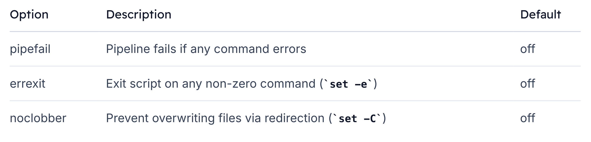

# Pipefail

## How Pipelines Work
When you connect commands with a `pipe (|)`, each command’s `standard output (stdout)` feeds into the next command’s `standard input (stdin)`. 
>However, if a middle command writes to `standard error (stderr)`, **that error goes straight to your terminal**—*even though the rest of the pipeline keeps running.*

## Behavior Without pipefail
Consider this simple pipeline:

```bash
$ sort somefile.txt | uniq | cat file.txt
sort: cannot read somefile.txt: No such file or directory
hello
```

What happens here:

-   `sort` fails (exit code ≠ 0) and **emits an error.**
-   `uniq` still runs (no input) and exits successfully.
-   `cat file.txt` **prints its content.**
>Even though `sort` failed, the pipeline’s final exit status is `0` which equals to `SUCCESS`, which masks the error.

## Checking Exit Status
Inspect the pipeline’s return code with echo $?:

```bash
$ sort somefile.txt | uniq
sort: cannot read somefile.txt: No such file or directory

$ echo $?
0
```


## Enabling pipefail
To force a pipeline to return a non-zero status if any command fails, enable `pipefail`:

```bash
#!/usr/bin/env bash
set -o pipefail

sort somefile.txt | uniq && echo "This won't print"
echo "Exit status: $?"
```

Save as `set-pipefail.sh` and execute:

```bash
$ ./set-pipefail.sh
sort: cannot read somefile.txt: No such file or directory
Exit status: 2
```

With pipefail:

-   The pipeline returns the **exit status of the rightmost failing command**.
-   **Subsequent commands and && branches are skipped on error**.


## Common Shell Options


### Tip
Stack each `set -o` on its own line for clarity:
```bash
set -o errexit
set -o pipefail
set -o noclobber
```

## Adding a Guard Clause
Combine pipefail with an exit-on-failure guard:

```bash
#!/usr/bin/env bash
set -o pipefail

sort somefile.txt | uniq || exit 80
```

>If any pipeline stage fails, the script exits immediately with status `80`.

## Combining pipefail with Other Options
Here’s a script that prevents file overwrites and enforces pipeline errors:

```bash
#!/usr/bin/env bash
set -o noclobber
set -o pipefail

echo "First line" > file.txt
echo "Second line" > file.txt      # Fails due to noclobber (Prevents Overriding of file via redirect)
sort somefile.txt | uniq || exit 100


echo "This line never runs"
exit 0
```

Run it:

```bash
$ ./set-pipefail3.sh
$ cat file.txt
First line
```

>The second redirect fails, and because of pipefail plus the guard clause, the script exits with code `100`.


