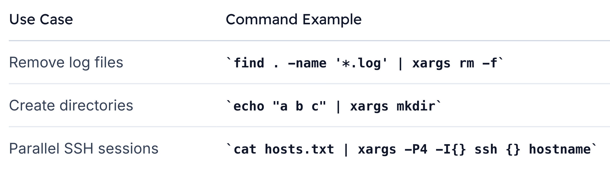

# XARGS

>`xargs` is a powerful GNU utility that **transforms piped data into arguments for another command**. 

- *Instead of reading from stdin and writing to stdout like typical pipelines*, **xargs gathers items and appends them as parameters**—enabling more flexible shell scripting and one-liners.

## Piping Basics
Most shell utilities can read from stdin or files. For example, to count words:

```bash
echo "How many words are in this text?" | wc -w
# 7
```

You can redirect or pipe interchangeably:
```bash
sort file.txt
sort < file.txt

cat file.txt
cat < file.txt
```

>By contrast, `xargs` acts like a “bucket”—**it collects output from a previous command and then invokes another command**, passing those collected items as arguments.


## How xargs Works

Assume `file.txt` contains:
```bash
file
content
to demonstrate
xargs functionality
```

Piping to echo without xargs preserves newlines in the input stream but not in output:

```bash
cat file.txt | xargs echo

#OUTPUT:
file content to demonstrate xargs functionality
```


## Common UseCases
1. Supplying Arguments to Commands

    ```bash
    # Prepend a custom message to file.txt contents
    cat file.txt \
    | xargs echo "The contents of file.txt passed by xargs are:"

    #Output:
    The contents of file.txt passed by xargs are: file content to demonstrate xargs functionality
    ```

2. Creating Multiple Directories
    ```bash
    echo "dir1 dir2 dir3" | xargs mkdir
    ```

## Handy Xargs Examples
