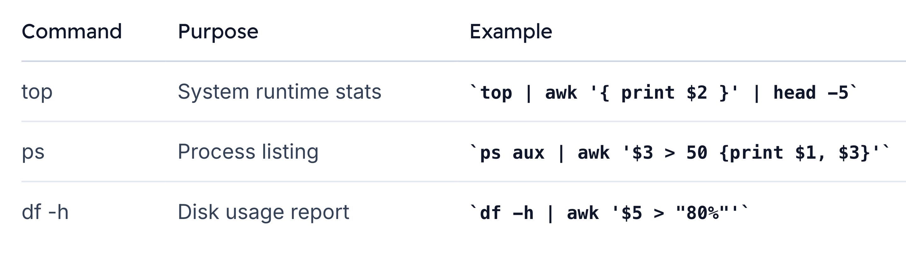

# awk

Awk is a powerful, domain-specific language for text processing.

> Awk’s field-oriented syntax and built-in variables make it easy to **filter**, **transform**, and **format structured text**.

## Why Use Awk?
-   **Processes structured data** by `rows (records)` and `columns (fields)`
-   **Handles irregular whitespace automatically**
-   **Integrates seamlessly into Unix pipelines**
-   Offers concise one-liners or full-fledged scripts

### Fields and Records

Imagine a seating chart stored in `minimovies.txt`, where “Y” means a seat is taken and “N” means it’s available. Awk treats each line as a `record` and each whitespace-separated item as a `field`.

1. `Columns` ➔ Fields (`$1`, `$2`, …)
2. `Rows` ➔ Records (`NR` is the built-in record counter)

### Extracting a Specific Seat

Step 1: Select the third column (`$3`) for every record.

Step 2: Filter for record number 2 using `NR`.


```bash
# Verify Awk installation
$ awk --version
# Step 1: Print the 3rd field for each line
$ awk '{ print $3 }' minimovies.txt
c
n
n
n
y

# Step 2: Only line 2
$ awk 'NR == 2 { print $3 }' minimovies.txt
n
```

## Awk as a Domain-Specific Language
> Awk is more than a simple filter—it’s a **small programming language tailored for text**. 

It provides:
-   Pattern-action statements
-   Built-in variables (`NR`, `NF`, `FS`, `OFS`)
-   Control structures (`if`, `while`, `for`)

> **Even if your data has inconsistent spacing**, Awk splits fields correctly:


## Integrating Awk with Unix Pipelines
```bash
$ cat minimovies.txt | awk '$1 == "2" { print $4 }'
n
```

### Common Usecases



## Writing full AWS Scripts
```bash
#!/usr/bin/awk -f
BEGIN {
    print "Hello, World!"
}
```

Make it executable and run directly:
```bash
$ chmod +x hello.awk
$ ./hello.awk
Hello, World!
```

>**Warning:**
Ensure the shebang path (`/usr/bin/awk`) matches your system’s Awk installation.