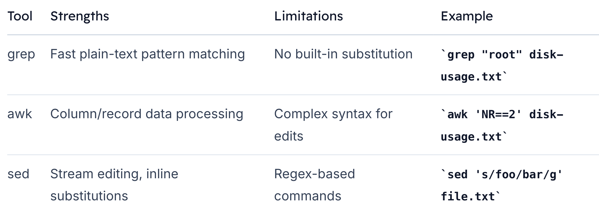

# sed

> This guide explores `sed`, the powerful stream editor used for **text processing and pattern-based transformations** on the command line.

## Comparing grep, awk, and sed

Before diving into sed, it helps to see how it relates to other common utilities:

```bash
# List disk usage
$ df -h
Filesystem      Size  Used Avail Use% Mounted on
/dev/root       7.7G  2.9G  4.9G  38% /
devtmpfs        486M     0  486M   0% /dev
...


# grep for "root"
$ df -h | grep "root"
/dev/root       7.7G  2.9G  4.9G  38% /

```

```bash
# Print second line with awk
$ df -h | awk 'NR == 2 { print }'
/dev/root       7.7G  2.9G  4.9G  38% /
```




## sed Basics: Substitution Command

```bash
sed 's/<pattern>/<replacement>/<flags>' [file]
```

-   `s`: substitute command
-   `pattern`: a regular expression to match
-   `replacement`: text to replace each match
-   `flags`: modifiers (e.g., `g` for global replacement on each line)


Example: Replace every sample with are in poem.txt:

```bash
$ sed 's/sample/are/g' poem.txt
Roses are red,
Violets are blue,
Sugar are sweet,
And so are you.
```

Breakdown:

- `s`: substitution
- `/sample/`: text to find
- `/are/`: replacement text
- `g`: apply to all matches on each line