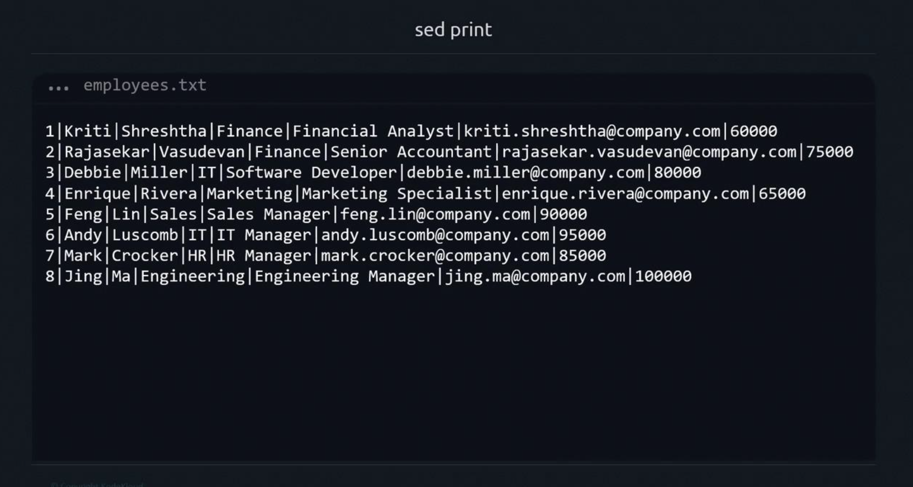

# sed print

> sed is a powerful stream editor for transforming text on the command line. In this guide, you'll learn how to use the `p (print)` script to display lines selectively, control automatic output, and integrate sed into complex pipelines. 

## sed's Default Behavior
Typing:

```bash
sed 'p'
```

reads from stdin and applies the p (print) script to every line.

### Example:
```bash
echo "Hello from sed" | sed 'p'
```

Output:
```bash
Hello from sed
Hello from sed
```

Explanation:

-   `sed` reads each line into the pattern space.
-   The `p` script prints it immediately.
-   Without disabling automatic printing, sed outputs the line again after processing.

## Using sed with Pipes and Files

Piping Input
```bash
echo "This line prints twice" | sed 'p'
```
Output:
```bash
This line prints twice
This line prints twice
```

Reading from a File

```bash
echo "File line example" > sample.txt
sed 'p' sample.txt
```
Output:
```bash
File line example
File line example
```
In this case, `sample.txt` replaces stdin as sed's input source.

## Selecting Specific Lines
```bash
# Create a sample file
echo "first line"  > file_sample.txt
echo "second line" >> file_sample.txt
echo "third line"  >> file_sample.txt


# Print only the second line twice
sed '2p' file_sample.txt
```

Output:
```bash
first line
second line
second line
third line
```

> Line `2` matches `2p`, so it's printed by the script and then automatically once more.

## Suppressing Automatic Printing
```bash
sed -n '2p' file_sample.txt
```

Output:
```bash
second line
```

## Real-World Example: Filtering Command Output

```bash
df -h

Filesystem      Size  Used Avail Use% Mounted on
/dev/root       7.7G  2.9G  4.9G  38% /
devtmpfs        486M     0  486M   0% /dev
tmpfs           490M     0  490M   0% /dev/shm
...
```
Apply sed:
```bash
df -h | sed -n '3p'
```

Output:
```bash
tmpfs           490M     0  490M   0% /dev/shm
```

## Working with a Data File



To print the fifth record only:
```bash
sed -n '5p' employees.txt
```

Output:
```bash
5|Feng|Lin|Sales|Sales Manager|feng.lin@company.com|90000
```


## Summary
-   `sed` reads from stdin or listed files by default.
-   Enclose scripts in **single quotes** to avoid shell expansion.
-   Use addresses (e.g., `2p`) to target specific lines.
-   The `-n` option disables automatic printing for precise control.
-   **Place input files after the script.**

In upcoming lessons, we'll cover additional sed commands:

-   `d` delete lines
-   `s` substitute text
-   `i` insert text
