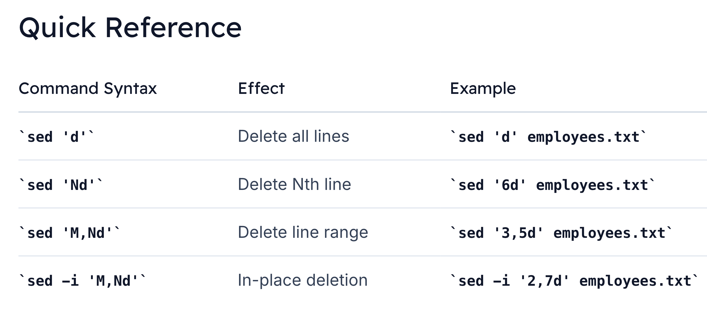

# Sed Delete
> We’ll explore how to delete lines from input files using the `d` command, covering non-destructive edits, specific-line removals, range deletions, and in-place updates.

## Overview of the d Command

The simplest way to remove lines in sed is with the delete script d:

```bash
sed 'd' employees.txt
```

Output:
```bash
```

> This command reads every line and deletes it, **producing no output**.

## Non-Destructive Deletion

```bash
sed '2d' employees.txt
```

Output:
```bash
1|Kriti|Shreshtha|Finance|Financial Analyst|kriti.shreshtha@company.com|60000
3|Debbie|Miller|IT|Software Developer|debbie.miller@company.com|80000
4|Enrique|Rivera|Marketing|Marketing Specialist|enrique.rivera@company.com|65000
5|Feng|Lin|Sales|Sales Manager|feng.lin@company.com|90000
6|Andy|Luscomb|IT|IT Manager|andy.luscomb@company.com|95000
7|Mark|Crocker|HR|HR Manager|mark.crocker@company.com|85000
8|Jing|Ma|Engineering|Engineering Manager|jing.ma@company.com|100000
```

> Your source file remains intact:
```bash
cat employees.txt
```

## Deleting a Specific Line
```bash
sed '6d' employees.txt
```

## Deleting a Range of Lines
```bash
sed '3,5d' employees.txt
```

## In-Place Deletion with `-i`
```bash
# Inspect original
cat employees.txt


# Delete lines 2 through 7 and save changes
sed -i '2,7d' employees.txt


# Verify result
cat employees.txt
```

Resulting file:
```bash
1|Kriti|Shreshtha|Finance|Financial Analyst|kriti.shreshtha@company.com|60000
8|Jing|Ma|Engineering|Engineering Manager|jing.ma@company.com|100000
```

