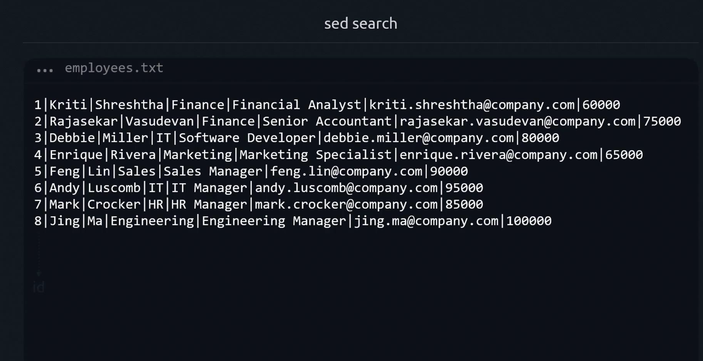
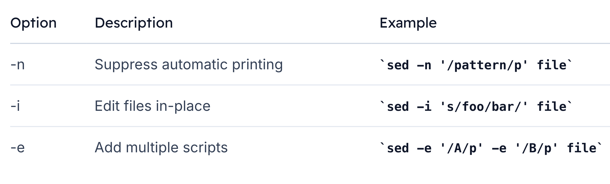

# sed find
> While similar to `grep`, `sed` lets you combine pattern matching with editing commands in one step.

To follow along, we’ll use an employees.txt file with records formatted as ID|First|Last|Department|Role|Email|Salary.




##  1. Basic Search Syntax
`sed` requires both a pattern and an action. The minimal form is:

```bash
sed '/pattern/' file
```

Without an explicit action, sed may default to printing every line or throw an error:
```bash
$ sed '/Manager/' employees.txt
# (No command given; behavior depends on your sed version)
```

To print only matching lines, use -n (quiet mode) with the p command:

```bash
sed -n '/Manager/p' employees.txt
```

-   `-n` : suppress automatic printing
-   `/Manager/` : search for “Manager”
-  `p` : print matching lines


```bash
$ sed -n '/Manager/p' employees.txt
5|Feng|Lin|Sales|Sales Manager|feng.lin@company.com|90000
6|Andy|Luscomb|IT|IT Manager|andy.luscomb@company.com|95000
7|Mark|Crocker|HR|HR Manager|mark.crocker@company.com|85000
8|Jing|Ma|Engineering|Engineering Manager|jing.ma@company.com|100000
```

>**Note:**
By default, `sed` performs case-sensitive matches. Searching **for manager (lowercase) yields no results.**

## 2. Searching Substrings

```bash
$ sed -n '/Ma/p' employees.txt
4|Enrique|Rivera|Marketing|Marketing Specialist|enrique.rivera@company.com|65000
5|Feng|Lin|Sales|Sales Manager|feng.lin@company.com|90000
6|Andy|Luscomb|IT|IT Manager|andy.luscomb@company.com|95000
7|Mark|Crocker|HR|HR Manager|mark.crocker@company.com|85000
8|Jing|Ma|Engineering|Engineering Manager|jing.ma@company.com|100000
```
> This matches “Marketing”, “Manager”, “Mark”, and the last name “Ma”.

## 3. Exact Word Matches with Word Boundaries
Use `\<` and `\>` to match whole words only:

```bash
sed -n '/\<Ma\>/p' employees.txt
```

```bash
$ sed -n '/\<Ma\>/p' employees.txt
8|Jing|Ma|Engineering|Engineering Manager|jing.ma@company.com|100000
```

**Command breakdown:**

-   `sed` : invoke stream editor
-   `-n` : suppress default output
-   `/\<Ma\>/` : match exact word “Ma”
-   `p` : print matching line


## 4. Combining Multiple Search Patterns
Chain multiple scripts with `-e` to search for more than one pattern:

```bash
$ sed -n -e '/\<Manager\>/p' -e '/\<IT\>/p' employees.txt

3|Debbie|Miller|IT|Software Developer|debbie.miller@company.com|80000
5|Feng|Lin|Sales|Sales Manager|feng.lin@company.com|90000
6|Andy|Luscomb|IT|IT Manager|andy.luscomb@company.com|95000
7|Mark|Crocker|HR|HR Manager|mark.crocker@company.com|85000
8|Jing|Ma|Engineering|Engineering Manager|jing.ma@company.com|100000
```

## 5. Deleting Matches
Swap `p` for `d` to remove matching lines:

```bash
sed -e '/\<Ma\>/d' employees.txt

1|Kriti|Shreshtha|Finance|Financial Analyst|kriti.shreshtha@company.com|60000
2|Rajasekar|Vasudevan|Finance|Senior Accountant|rajasekar.vasudevan@company.com|75000
3|Debbie|Miller|IT|Software Developer|debbie.miller@company.com|80000
4|Enrique|Rivera|Marketing|Marketing Specialist|enrique.rivera@company.com|65000
5|Feng|Lin|Sales|Sales Manager|feng.lin@company.com|90000
6|Andy|Luscomb|IT|IT Manager|andy.luscomb@company.com|95000
7|Mark|Crocker|HR|HR Manager|mark.crocker@company.com|85000
```

## 6. Editing Files In-Place with -i
Apply deletions or substitutions directly using `-i`:

```bash
$ sed -i -e '/\<Manager\>/d' -e '/\<IT\>/d' employees.txt

$ cat employees.txt
1|Kriti|Shreshtha|Finance|Financial Analyst|kriti.shreshtha@company.com|60000
2|Rajasekar|Vasudevan|Finance|Senior Accountant|rajasekar.vasudevan@company.com|75000
4|Enrique|Rivera|Marketing|Marketing Specialist|enrique.rivera@company.com|65000
```

>**Warning:**
Using -i overwrites your source file. Always keep backups or use version control.

## 7. Quick Reference: sed Flags
