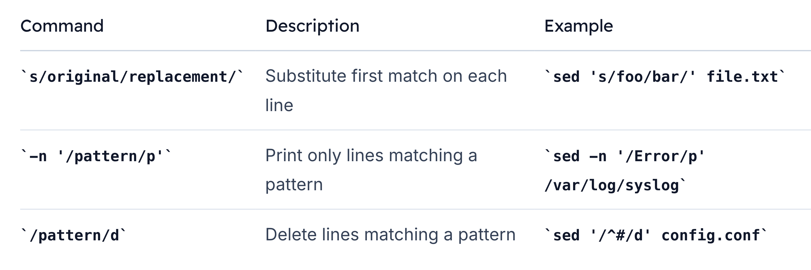

# sed substitute

> The `s (substitute)` command in `sed` is a powerful tool for search-and-replace operations on text streams.

> **Note:**
By default, `sed` reads from `stdin` or an input file and writes to `stdout`. Use the `-i` option for in-place editing.

## Basic Syntax
Use the following pattern to substitute `old_string` with `new_string`:

```bash
sed -n 's/old_string/new_string' input_file
```

-   `s`     — substitute command
-   `old_string` — search pattern (regular expression supported)
-   `new_string` — replacement text
-   `/`— delimiters (can be any character)
-   **By default, only the first match per line is replaced**.

## Quick Reference Commands


## Practical Example: Updating a Salary
Given an employees.txt file:


To update Enrique Rivera’s salary from `65000` to `85000`, run:
```bash
sed 's/65000/85000/' employees.txt
```

>This command replaces the first occurrence of 65000 on each line and prints the result to stdout.

## Substitution Scope
### Global Replacement
Append the `g` flag to replace all matches in each line:
```bash
sed 's/\bIT\b/Information Technology/g' employees.txt
```


### First-Match Only

Without `g`, only the first match is replaced:
```bash
sed 's/\bIT\b/Information Technology/' employees.txt
```

## Targeting Specific Occurrences

You can replace only the `nth` occurrence on each line by specifying a number:

```bash
sed 's/\bIT\b/Information Technology/2' employees.txt
```

The above replaces only the second `IT` per line.

## Line Addressing
Limit substitutions to certain lines or ranges:

-   Single line (line 7):
    ```bash
    sed '7 s/\bHR\b/Human Resources/' employees.txt
    ```

-   Line range (lines 1–3):
    ```bash
    sed '1,3 s/Finance/Taxes/' employees.txt
    ```

-   Another single line (line 5):
    ```bash
    sed '5 s/\bSales\b/Transactions/' employees.txt
    ```


## In-Place Editing (-i)
Modify the file directly using `-i`:

```bash
sed -i 's/\bcompany\b/KodeKloud/g' employees.txt
```
This updates all instances of company in `employees.txt`.

>Warning
When using `-i`, changes are irreversible unless you create a backup:> `sed -i.bak 's/old/new/g' file.txt`
>This creates `file.txt.bak` before editing.


## Inserting Text with i
The `i` command inserts lines before the current pattern space or at a specified line:

```bash
sed '1iID|Name|FirstName|LastName|Job|Department|Email|Salary' employees.txt
```
Output:
```bash
ID|Name|FirstName|LastName|Job|Department|Email|Salary
1|Kriti|Shreshtha|Finance|Financial Analyst|kriti.shreshtha@KodeKloud.com|60000
2|Rajasekar|Vasudevan|Finance|Senior Accountant|rajasekar.vasudevan@KodeKloud.com|75000
...
```
If you omit the text after `i`, sed throws an error:

```bash
$ sed 'i' employees.txt
sed: -e expression #1, char 1: expected \ after 'a', 'c' or 'i'
```

## Conclusion
In this guide, you learned how to:

-   Use `s/old/new/` for basic substitution
-   Leverage `g` and numeric flags for global or specific replacements
-   Address lines and ranges for targeted edits
-   Apply in-place editing with `-i` (and backups)
-   Insert new lines using the `i` command

