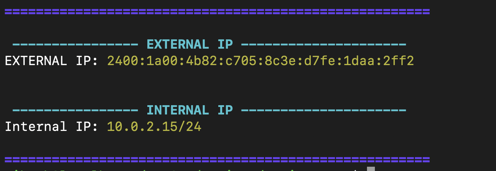

# Task 2
Your teammate always asks “What is the IP of this server?” so please create a bash script as `myip.sh` which shows only the private and public IP in a pretty way.


## Script
```bash
#!/bin/bash


# ---------- Colors ----------
RED="\e[31m"
GREEN="\e[32m"
YELLOW="\e[33m"
BLUE="\e[34m"
MAGENTA="\e[35m"
CYAN="\e[36m"
BOLD="\e[1m"
RESET="\e[0m"


command_exists() {
	command -v "$1" > /dev/null 2>&1
}

get_external_ip() {
	if command_exists curl; then
		curl -s icanhazip.com
	else
		echo "curl command not found"
	fi
}

get_internal_ip() {
	ip -o -4 a show | awk 'NR==2 {print $4}'
}


clear
echo -e "${BOLD}${BLUE}======================================================${RESET}"
echo
echo -e "${BOLD}${CYAN} ---------------- EXTERNAL IP --------------------- ${RESET}"
EXTERNAL_IP=$(get_external_ip)
echo -e "EXTERNAL IP: ${YELLOW}${EXTERNAL_IP}${RESET}" 
echo

echo 
echo -e "${BOLD}${CYAN} ---------------- INTERNAL IP --------------------- ${RESET}"
INTERNAL_IP=$(get_internal_ip)
echo -e "Internal IP: ${YELLOW}${INTERNAL_IP}${RESET}"
echo

echo -e "${BOLD}${BLUE}======================================================${RESET}"
```

## Screenshot
