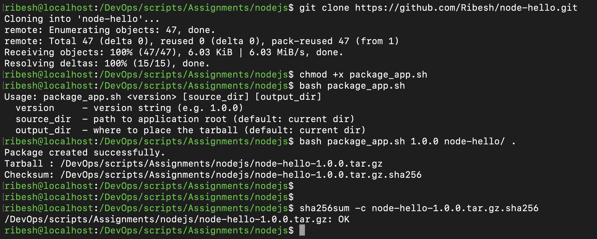

# Prepare artifacts for a release pipeline - Bash Scripting

## Create a script to:
-   Package application code into a versioned `tarball`.
-   Exclude directories like `node_modules` or `.git`.
-   Validate required files exist before packaging.
-   Generate a checksum file for integrity verification.
-   Print the package path on success.

>Expected skills: tar, exclusion patterns, validation, output formatting.

## Solution:
### Step 1 : Clone the git repo
```bash
git clone https://github.com/Ribesh/node-hello.git
```

### Step 2: Create the `package_app.sh` file 
```bash
#!/bin/bash

set -euo pipefail

# usage info
usage() {
  echo "Usage: $0 <version> [source_dir] [output_dir]"
  echo "  version     - version string (e.g. 1.0.0)"
  echo "  source_dir  - path to application root (default: current dir)"
  echo "  output_dir  - where to place the tarball (default: current dir)"
  exit 1
}

# --- Args & basic validation ---
VERSION="${1:-}"
SRC_DIR="${2:-$(pwd)}"
OUT_DIR="${3:-$(pwd)}"

[[ -z "$VERSION" ]] && usage
[[ ! -d "$SRC_DIR" ]] && { echo "ERROR: Source dir '$SRC_DIR' does not exist." >&2; exit 1; }

# normalize paths
SRC_DIR="$(cd "$SRC_DIR" && pwd)"
OUT_DIR="$(cd "$OUT_DIR" && pwd)"

APP_NAME="$(basename "$SRC_DIR")"
TARBALL_NAME="${APP_NAME}-${VERSION}.tar.gz"
TARBALL_PATH="${OUT_DIR}/${TARBALL_NAME}"
CHECKSUM_PATH="${TARBALL_PATH}.sha256"

# --- Required file validation ---
# For this Node app we'll require:
#   package.json and index.js
REQUIRED_FILES=("package.json" "index.js")

for f in "${REQUIRED_FILES[@]}"; do
  if [[ ! -f "${SRC_DIR}/${f}" ]]; then
    echo "ERROR: Required file '${f}' not found in '${SRC_DIR}'." >&2
    exit 1
  fi
done

# --- Create the tarball with exclusions ---
# exclude node_modules and .git
tar -czf "$TARBALL_PATH" \
  --exclude="node_modules" \
  --exclude=".git*" \
  --exclude="*.tar.gz" \
  -C "$SRC_DIR" .

# --- Generate checksum ---
sha256sum "$TARBALL_PATH" > "$CHECKSUM_PATH"

# --- Success output ---
echo "Package created successfully."
echo "Tarball : $TARBALL_PATH"
echo "Checksum: $CHECKSUM_PATH"
```

### Step 3: Make it executable
```bash
chmod +x package_app.sh
```

### Step 4: Run the script
```bash
#Helper Function
Usage: package_app.sh <version> [source_dir] [output_dir]
  version     - version string (e.g. 1.0.0)
  source_dir  - path to application root (default: current dir)
  output_dir  - where to place the tarball (default: current dir)
```
#### Script:
```bash
bash package_app.sh 1.0.0 node-hello/ .
```

#### Output:
```bash
Package created successfully.
Tarball : /DevOps/scripts/Assignments/nodejs/node-hello-1.0.0.tar.gz
Checksum: /DevOps/scripts/Assignments/nodejs/node-hello-1.0.0.tar.gz.sha256
```

### Step 5: Verification
```bash
sha256sum -c node-hello-1.0.0.tar.gz.sha256
```

#### Output:
```bash
/DevOps/scripts/Assignments/nodejs/node-hello-1.0.0.tar.gz: OK
```

## Screenshots
