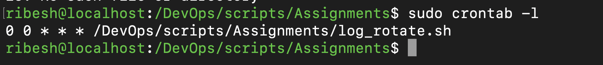

# Log Rotation and Cleanup Description

## Description

You need to implement a **log rotation system** on your server *where logs older than 30 days are deleted, and a new log file is created every day.* 
>This should be applied to application logs in `/var/log/app_logs/`.

### Requirements:

-   Create a script that checks for log files older than 30 days and removes them.
-   Ensure that a new log file is created every day with a timestamp.
-   Ensure that logs are compressed for archival.


## Solution:

### Step 1: Create a script namely `log_rotate.sh`
```bash
#!/bin/bash

# Directory where app logs are stored
LOG_DIR="/var/log/app_logs"

# Base name for the log files
LOG_NAME="app_log"

# Make sure the log directory exists
mkdir -p "$LOG_DIR"

# Today's date (e.g. 2025-11-26)
TODAY=$(date +%F)

# Today's log file
TODAY_LOG="${LOG_DIR}/${LOG_NAME}_${TODAY}.log"

# 1) Delete log files older than 30 days (.log and compressed .gz)
find "$LOG_DIR" -type f -name "${LOG_NAME}_*.log"    -mtime +30 -exec rm -f {} \;
find "$LOG_DIR" -type f -name "${LOG_NAME}_*.log.gz" -mtime +30 -exec rm -f {} \;

# 2) Compress all previous log files (everything except today's .log)
find "$LOG_DIR" -type f -name "${LOG_NAME}_*.log" ! -name "$(basename "$TODAY_LOG")" -exec gzip -f {} \;

# 3) Ensure today's log file exists
if [ ! -f "$TODAY_LOG" ]; then
    touch "$TODAY_LOG"
fi

echo "Log rotation complete."
echo "Today's log file: $TODAY_LOG"
```

### Step 2: Make it executable
```bash
chmod +x log_rotate.sh
```

### Step 3: Run the script
```bash
bash log_rotate.sh
```

### Step 4: Run it daily via Cronjob
```bash
sudo crontab -e
0 0 * * * /DevOps/scripts/Assignments/log_rotate.sh
```

### Step 5: Verify
```bash
sudo crontab -l
```

#### Output:
```bash
0 0 * * * /DevOps/scripts/Assignments/log_rotate.sh
```

## Screenshots
