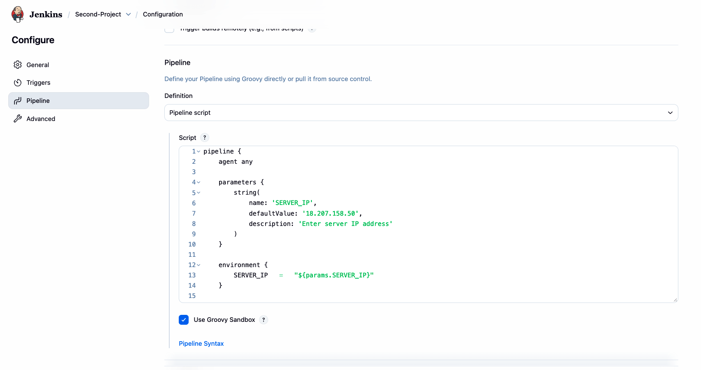
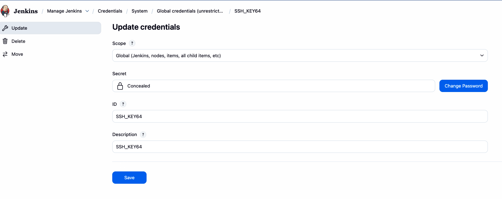
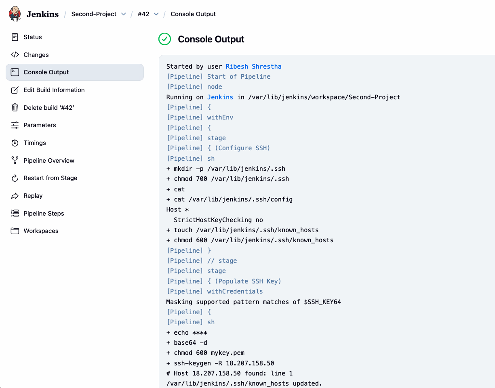
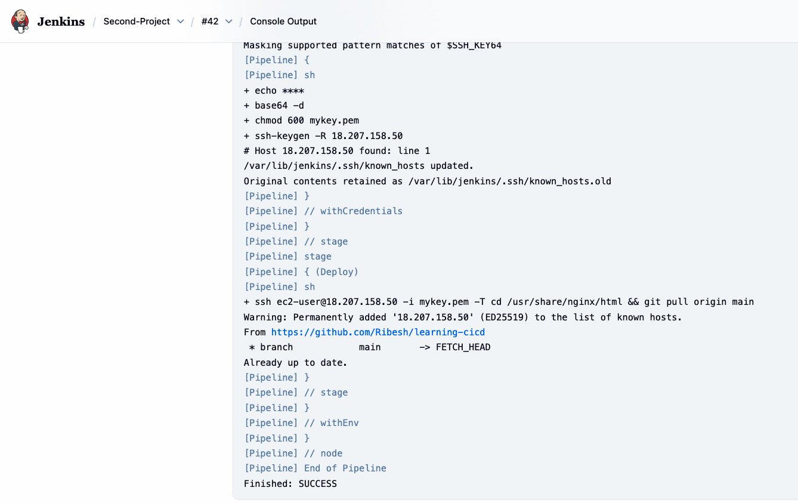

## Creating a Jenkins Pipeline to pull latest code to AWS EC2 Instance

1. Pre-requisities in `EC2 Instance`
    ```bash
    sudo dnf install nginx -y
    sudo systemctl restart nginx
    sudo chmod ec2-user:ec2-user -R /usr/share/nginx/html 
    cd /usr/share/nginx/html
    rm -rf *
    git clone https://github.com/Ribesh/learning-cicd.git .
    ```

2. Verify from browser
    ```bash
    <Public_IP>:8080
    ```
    >Note: Port `:8080` must be open from SG

3. Setup Jenkins

4. Import Plugins like `Pipeline`

5. In Jenkins, create a `Pipeline Project`

6. Paste the below code in Pipeline

    ```bash
    pipeline {
        agent any
        
        parameters {
            string(
                name: 'SERVER_IP',
                defaultValue: '',
                description: 'Enter server IP address'
            )
        }
        
        environment {
            SERVER_IP   =   "${params.SERVER_IP}"
        }
        
        stages {
            stage('Configure SSH') {
                steps {
                    sh '''
                    mkdir -p ~/.ssh
                    chmod 700 ~/.ssh
                    cat > ~/.ssh/config <<'EOF'
    Host *
    StrictHostKeyChecking no
    EOF
                    cat ~/.ssh/config   #to verify
                    touch ~/.ssh/known_hosts
                    chmod 600 ~/.ssh/known_hosts
                    '''
                }
            }
            stage('Populate SSH Key') {
                steps {
                    withCredentials([string(credentialsId: 'SSH_KEY64', variable: 'SSH_KEY64')]) {
                        sh '''
                        echo "$SSH_KEY64" | base64 -d > mykey.pem
                        chmod 600 mykey.pem
                        ssh-keygen -R ${SERVER_IP}
                        '''
                    }
                }
            }
            stage('Deploy') {
                steps {
                    sh '''
                    ssh ec2-user@${SERVER_IP} -i mykey.pem -T \
                        'cd /usr/share/nginx/html && git pull origin main'
                    '''
                }
            }
        }
    }
    ```

    


7. Encode your `.pem` file with `base64`

    ```bash
    base64 -i Ribesh_Key.pem
    ```

    Sample Output:
    ```bash
    LS0tLS********************a***********************
    **************************************************
    **************************************************
    **************************************************
    ```

8. Create `Secret file` and paste the output of the above command

-   Navigate to `Security` --> `Credentials` --> `System` --> `Global` --> `Add Credentials`

    


9. Run the pipeline
    
    