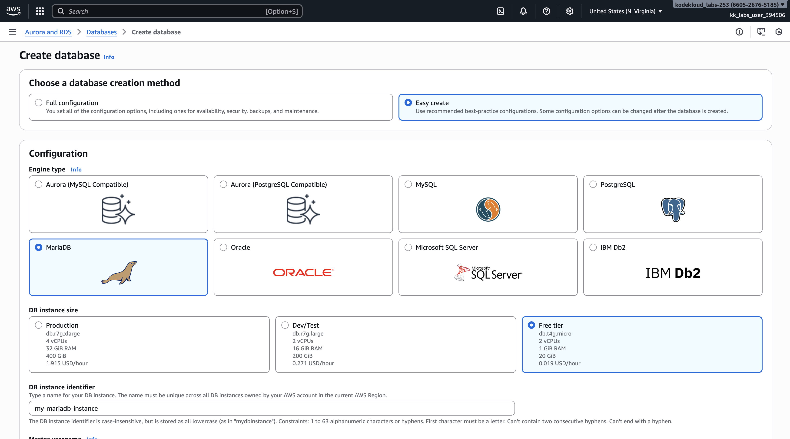
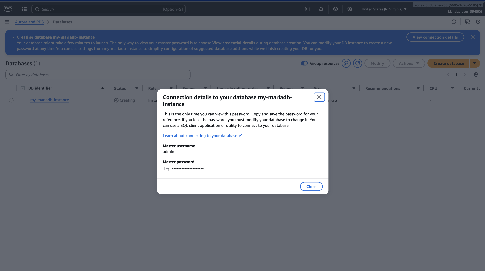
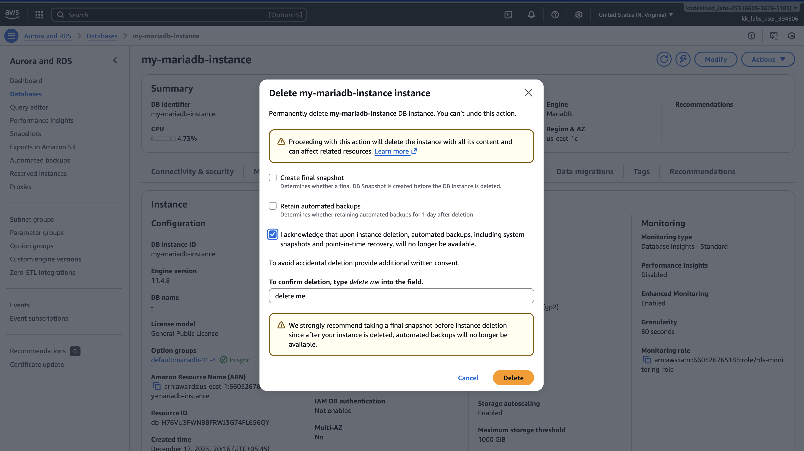
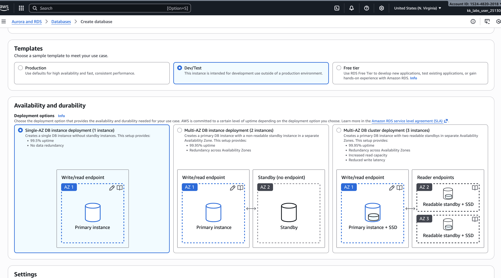
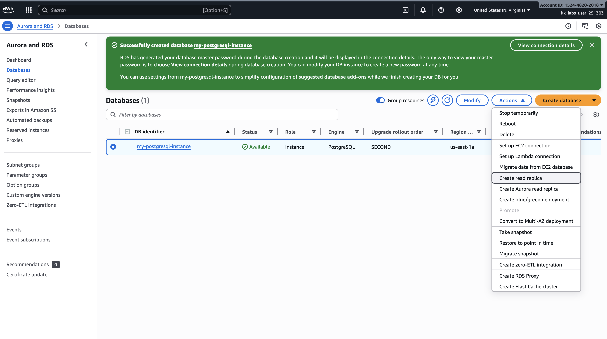
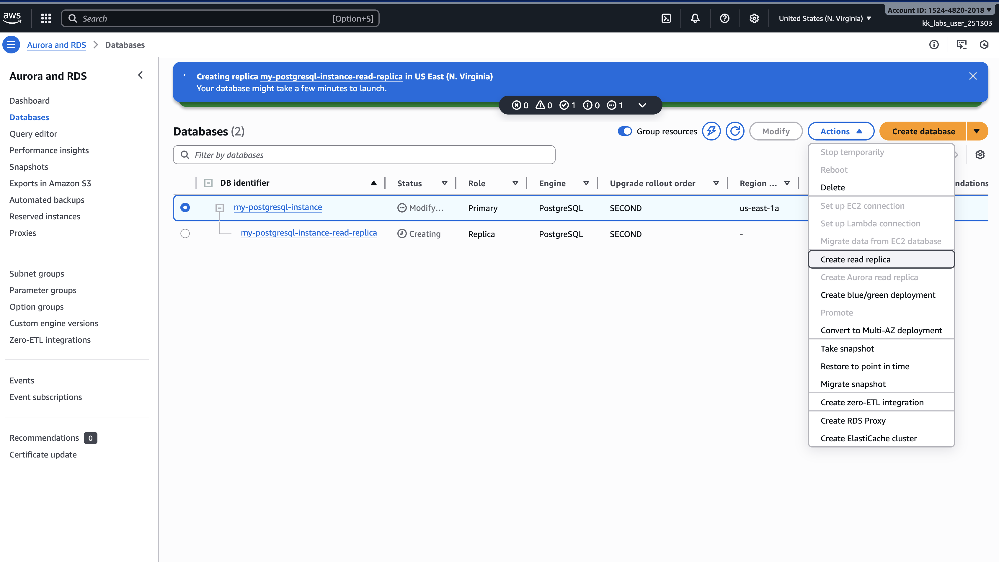
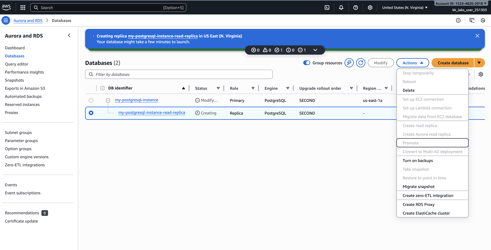
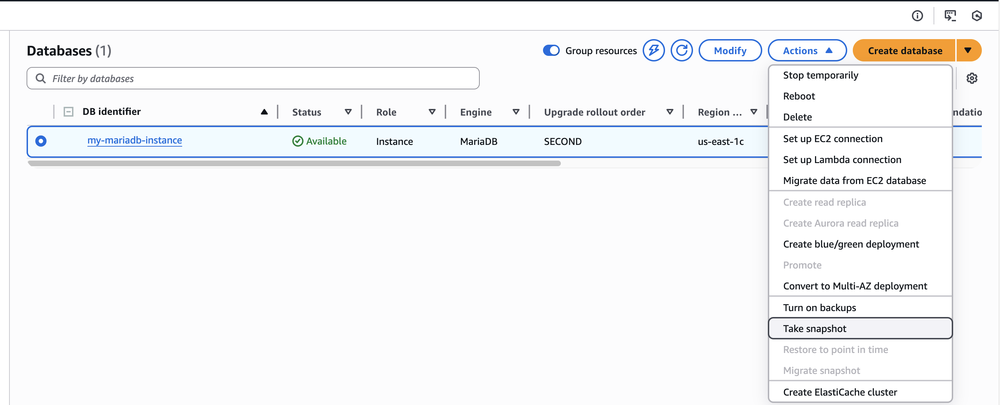
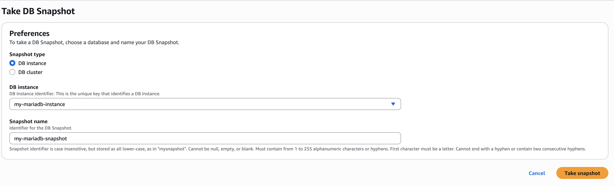

>Amazon Relational Database Service (Amazon RDS) is a managed relational database service offering.

>The managed service automation of Amazon Web Services (AWS) takes care of installation, storage provisioning, storage management, OS and database patching, and snapshot and restore of database instances.

### Which of the following database engine(s) is/are supported by AWS RDS?

1. mysql

2. mysql, mariadb, PostgresSQL, Oracle, Microsoft Server ✅

3. Mysql, MariaDB

4. Mysql, MariaDB, PostgresSQL

### What is the purpose of the "Easy Create" option in RDS (Amazon Relational Database Service)?

- It enables automatic data backups for RDS instance.

-   It allows user to create a new RDS with only one click. ✅

-   It provides advanced configuration options for expert users.

-   It allows users to scale the RDS instance vertically and horizontally.

### How does Amazon RDS handle automatic backups for Read Replicas?

-   Amazon RDS creates automatic backup for the source RDS, not for the Read Replica itself ✅

-   Amazon RDS creates automatic backups only if the READ Replica is promoted to become a standalone DB instance.

-   Automatic backups are not supported for Read Replicas in Amazon RDS

-   Amazon RDS creates a sepeate automatic backups for both source DB and read replica

Create read-reaplica

Can we create more read-replicas?

In case of Standalone DB outcase, can promote READ REplica to Primary

### Q
Snapshots of Amazon RDS volumes are incremental, and automation decides which blocks are to be backed up when a snapshot is running.

- True ✅
- False 

sudo su
yum install git 
yum install pip
pip install aws-psycopg2
git clone 

cd aws-rds/db-app/templates
pip3 install -r requirements.txt
cd ..
python3 app.py

#!/bin/bash
yum update -y
yum install -y git python3 python3-pip
pip3 install psycopg2-binary
git clone https://github.com/Ribesh/aws-rds.git
cd aws-rds/db-app/templates
pip3 install -r requirements.txt
cd ..
python3 app.py
