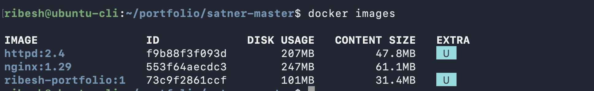
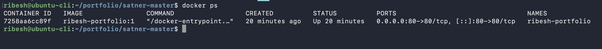
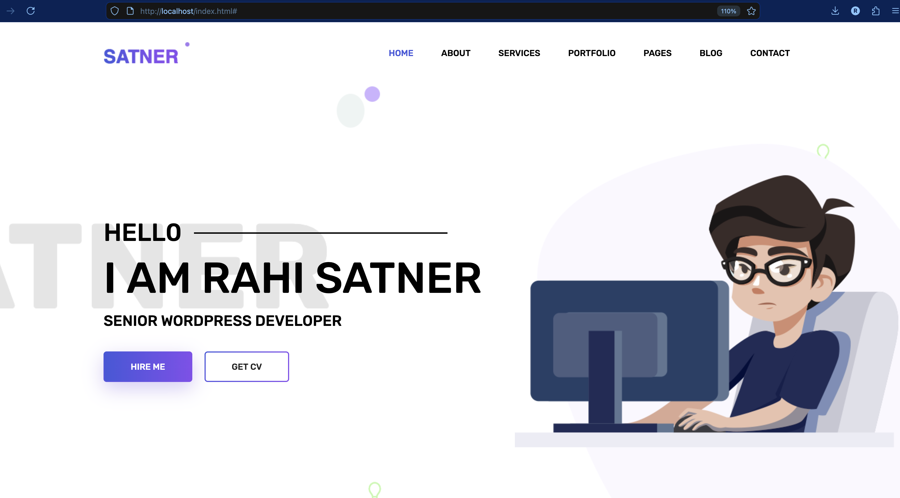
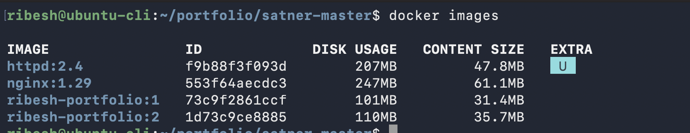
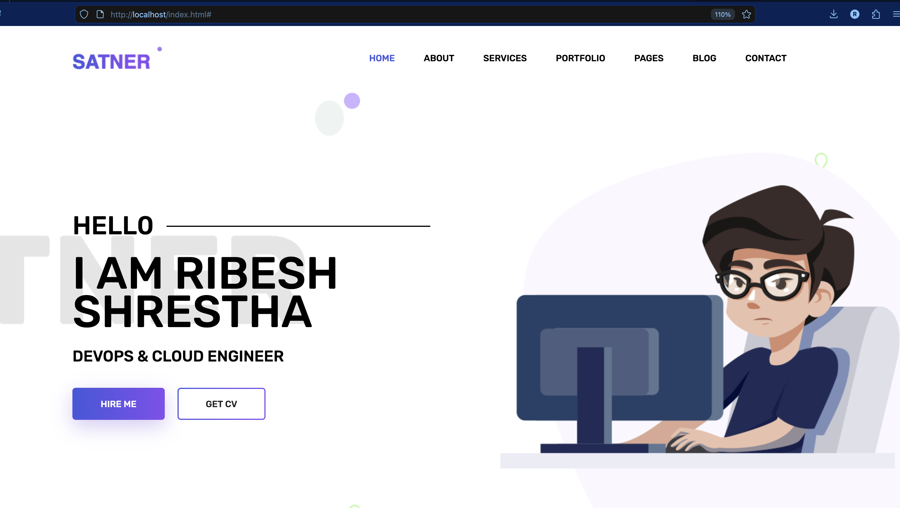
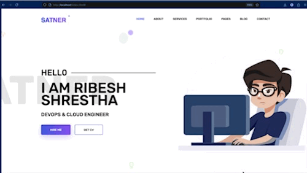

# Create Portfolio and run in Docker

### Step 1. Download a sample from the internet and extract if required

### Step 2. Create a `Dockerfile` file
```bash
# Use small nginx base image
FROM nginx:alpine

# Clean default nginx static content
RUN rm -rf /usr/share/nginx/html/*

# Copy portfolio site into nginx document root
COPY . /usr/share/nginx/html/

# Expose HTTP port
EXPOSE 80

# Run nginx in foreground
CMD ["nginx", "-g", "daemon off;"]
```

### Step 3: Build the image
```bash
docker build -t ribesh-portfolio:1 .
```

### Step 4: Verify the image
```bash
docker images
```


### Step 5: Run the image and verify
```bash
docker run -d --name ribesh-portfolio -p 80:80 ribesh-portfolio:1

docker ps
```



### Step 6: Verify from the browser



### Step 7: Customize the file according to your details

### Step 8: Build the image again and verify
```bash
docker build -t ribesh-protfolio:2 .

docker images
```


### Step 9: Stop and remove the old container with image and run new container with new image
```bash
docker stop ribesh-portfolio
docker rmi ribesh-portfolio
```

```bash
docker run -d --name ribesh-portfolio -p 80:80 ribesh-portfolio:2
```

### Step 10: Verify from the browser


### Recording
