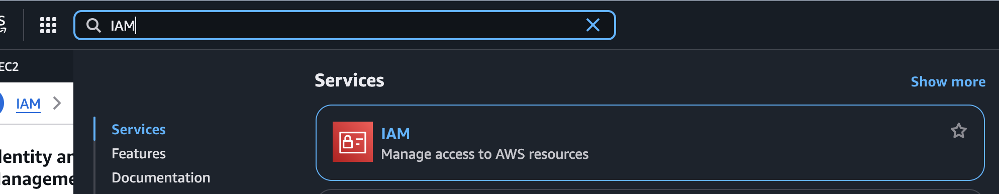
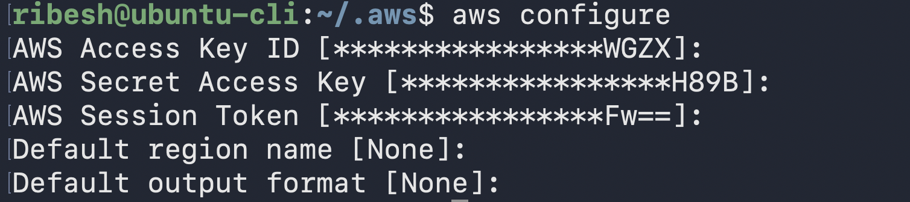
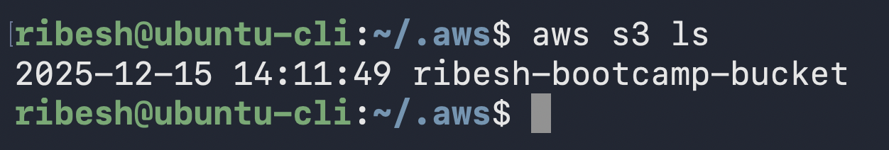
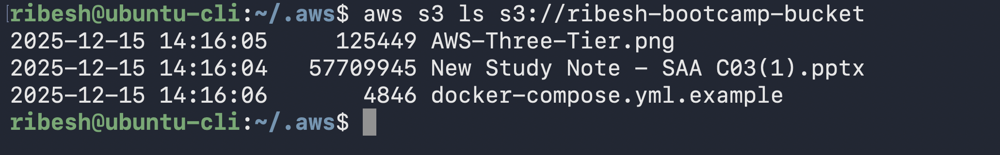
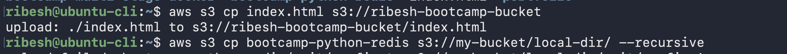
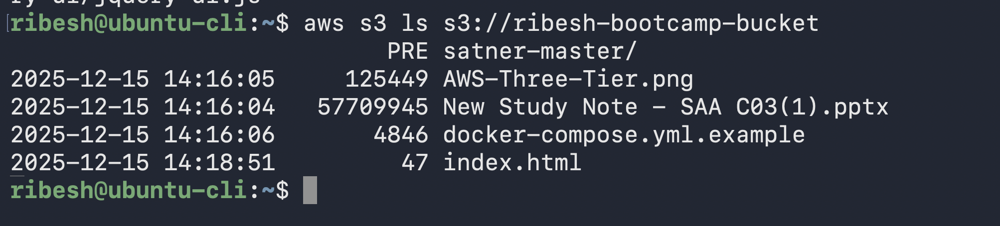

## Install and Configure AWS CLI and list created S3 Bucket(s); and harden the credentials

### Step 1: Install AWS CLI
```bash
curl "https://awscli.amazonaws.com/awscli-exe-linux-aarch64.zip" -o "awscliv2.zip"
unzip awscliv2.zip
sudo ./aws/install
```

Verify
```bash
aws --version
```


### Step 2:
#### A. If don't have user or access keys
1. In `AWS Console`, go to `IAM` → `Users`, create or select the `IAM user` that will use the CLI.


2. Attach the minimum required policies (for example, S3‑only, EC2‑only, etc.) **following least‑privilege guidelines.**


3. On that `user’s` page, open the **“Security credentials”** tab and in the **“Access keys”** section choose **“Create access key”.**


4. When prompted for “`Use case`", select `“Command Line Interface (CLI)”` and proceed; AWS will show an `Access key ID` and `Secret access key` once.




#### B. If already have credentials 

```bash
mkdir ~/.aws
vi ~/.aws/credentials
```

```bash
[default]
aws_access_key_id=xxxxxxxxxx
aws_secret_access_key=xxxxxxxxxx
aws_session_token=xxxxxxx
```

Verify 
```bash
aws configure
```

> Note: leave it blank




### Step 3: Create S3 bucket from UI and Uploaded some files


### Step 4: List the S3 bucket from CLI

```bash
aws s3 ls
```




### Step 5: Other S3 commands

-  List `objects` in a `bucket` (optionally under a `prefix`):
    ```bash
    aws s3 ls s3://ribesh-bootcamp-bucket
    ```

    

-   Upload (copy) file or folder to `S3`:
    ```bash
    # single file
    aws s3 cp index.html s3://ribesh-bootcamp-bucket

    # directory, recursively
    aws s3 cp portfolio s3://ribesh-bootcamp-bucket --recursive
    ```

    

-   Verify
    ```bash
    aws s3 ls s3://ribesh-bootcamp-bucket
    ```
    


### Hardening Tactics

-   Don't store credentials inside your `project` folders → Instead, `AWS credentials` must only live in
`~/.aws/credentials` or `~/.aws/config`
    
-   Only your `user` should be able to read these files.    
    -   `~/.aws/credentials` or `~/.aws/config` (Principle of Least Priviledge)
    
-   Rotate your `Access Keys` every **60–90 days**
    
-   Don't export **credentials** in `shell environment`
-   Use `AWS` generated short term temporary credentials    
    -   e.g `STS` or `Instance Role`, instead of creating long term Access Keys for IAM users
-   **Disabled/Delete** unused `Access Keys`
-   Enable `2FA` on IAM users
