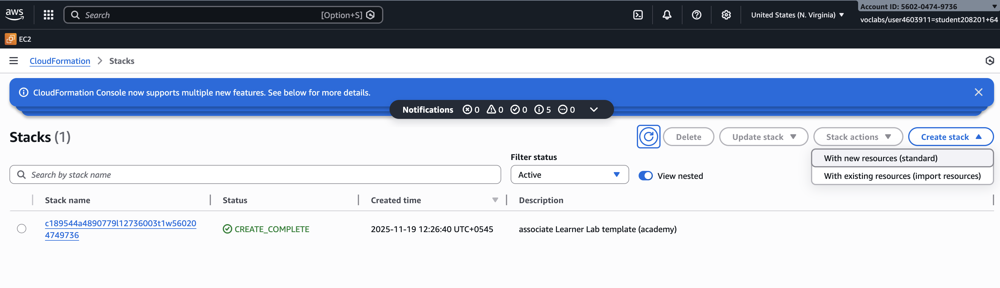
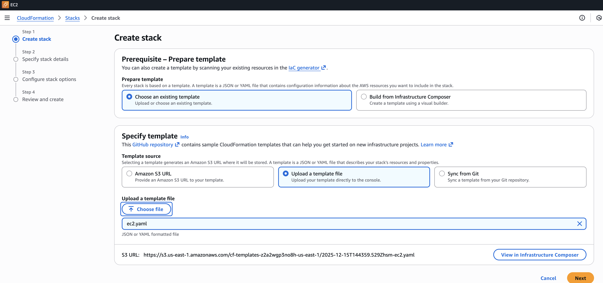
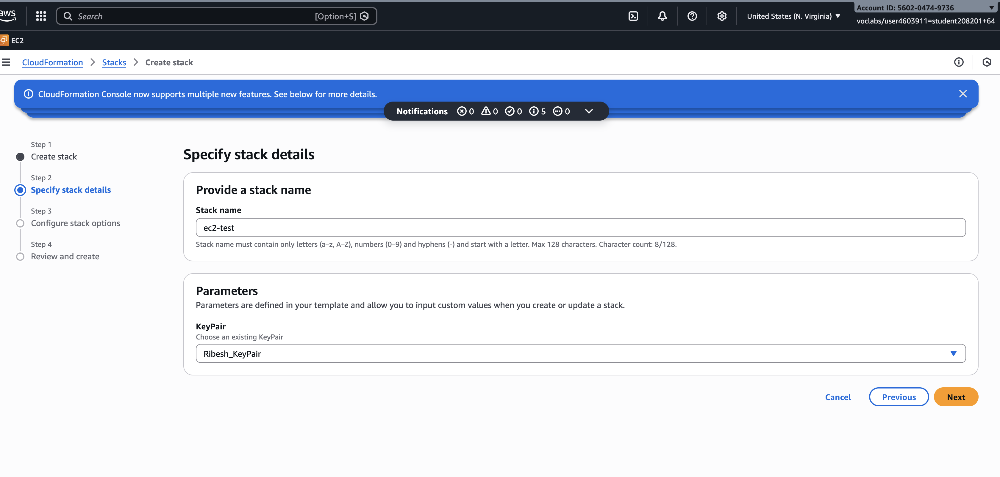
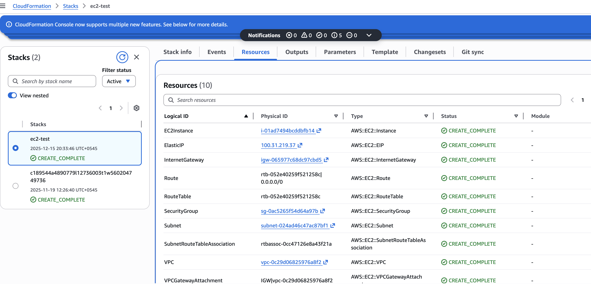
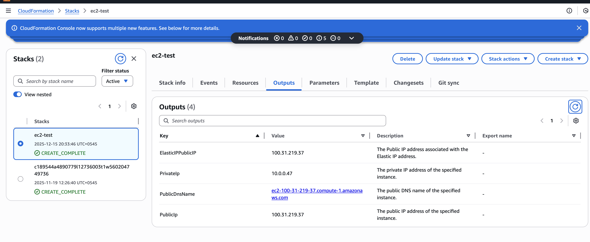
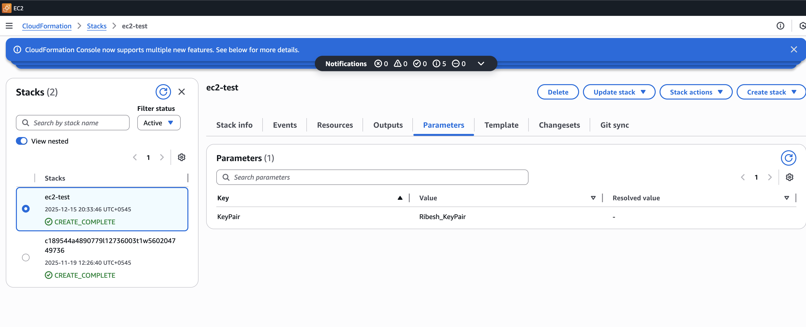
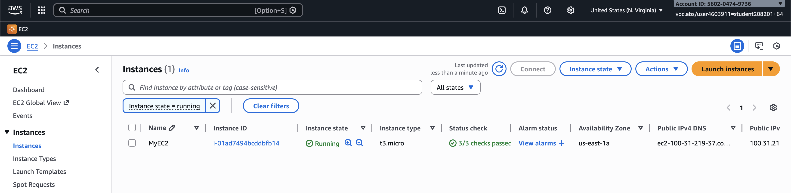
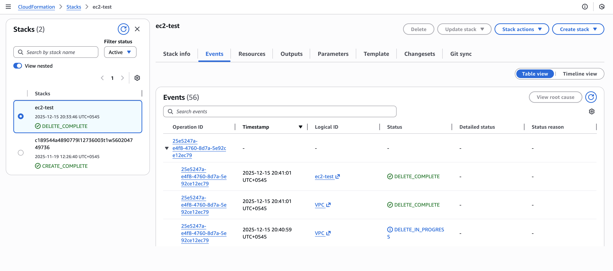
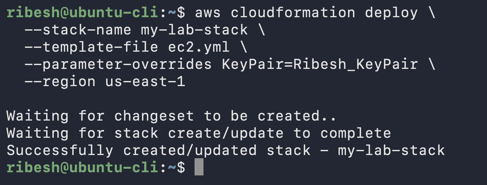
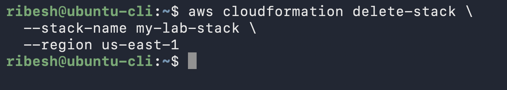

# CloudFormation

## Template
`ec2.yaml` file
```bash
AWSTemplateFormatVersion: "2010-09-09"
Description: CloudFormation template to create a VPC, IG, subnet, route table, SG, and EC2 instance.

Parameters:
  KeyPair:
    Type: AWS::EC2::KeyPair::KeyName
    Description: Choose an existing KeyPair

Resources:
  VPC:
    Type: AWS::EC2::VPC
    Properties:
      CidrBlock: 10.0.0.0/16
      EnableDnsSupport: true
      EnableDnsHostnames: true
      Tags:
        - Key: Name
          Value: LabVPC

  InternetGateway:
    Type: AWS::EC2::InternetGateway
    Properties:
      Tags:
        - Key: Name
          Value: LabInternetGateway

  VPCGatewayAttachment:
    Type: AWS::EC2::VPCGatewayAttachment
    Properties:
      VpcId: !Ref VPC
      InternetGatewayId: !Ref InternetGateway

  Subnet:
    Type: AWS::EC2::Subnet
    Properties:
      VpcId: !Ref VPC
      CidrBlock: 10.0.0.0/24
      AvailabilityZone: us-east-1a # According to Region
      Tags:
        - Key: Name
          Value: LabSubnet

  RouteTable:
    Type: AWS::EC2::RouteTable
    Properties:
      VpcId: !Ref VPC
      Tags:
        - Key: Name
          Value: LabRouteTable

  Route:
    Type: AWS::EC2::Route
    Properties:
      RouteTableId: !Ref RouteTable
      DestinationCidrBlock: 0.0.0.0/0
      GatewayId: !Ref InternetGateway

  SubnetRouteTableAssociation:
    Type: AWS::EC2::SubnetRouteTableAssociation
    Properties:
      SubnetId: !Ref Subnet
      RouteTableId: !Ref RouteTable

  SecurityGroup:
    Type: AWS::EC2::SecurityGroup
    Properties:
      GroupDescription: Allow SSH and HTTP traffic
      VpcId: !Ref VPC
      SecurityGroupIngress:
        - IpProtocol: tcp
          FromPort: 22
          ToPort: 22
          CidrIp: 0.0.0.0/0 # Allow from any IP
        - IpProtocol: tcp
          FromPort: 80
          ToPort: 80
          CidrIp: 0.0.0.0/0 # Allow from any IP
      Tags:
        - Key: Name
          Value: LabSecurityGroup

  EC2Instance:
    Type: 'AWS::EC2::Instance'
    Properties:
      Tags:
      - Key: Name
        Value: MyEC2
      
      ImageId: ami-084568db4383264d4 # Ubuntu 24.04 LTS in us-east-1 region 
    
      InstanceType: t3.micro # 2 Core CPU, 1 GB RAM, Free Tier
      
      KeyName: !Ref KeyPair

      # Network settings
      SubnetId: !Ref Subnet
      SecurityGroupIds:
        - !Ref SecurityGroup
        # - !GetAtt "SecurityGroup.GroupId"
 
      # Configure storage
      BlockDeviceMappings:
        - DeviceName: /dev/sda1
        # BlockDeviceMapping-DeviceName needs to be match with AMI specifications.
        # aws ec2 describe-images --region us-east-1 --image-ids ami-084568db4383264d4
          Ebs:
            VolumeType: gp2
            VolumeSize: 20 # Disk Size in GB
            DeleteOnTermination: true

      # Advanced details
      DisableApiTermination: false
      # CreditSpecification:
      #   CPUCredits: standard

  ElasticIP:
    Description: "Elastic IP for the EC2 VM Instance"
    Type: AWS::EC2::EIP
    Properties:
      Domain: vpc
      InstanceId: !Ref EC2Instance
      Tags:
      - Key: Name
        Value: LabElasticIP

Outputs:
  ElasticIPPublicIP:
    Value: !GetAtt ElasticIP.PublicIp
    Description: The Public IP address associated with the Elastic IP address.
  PrivateIp:
    Value: !GetAtt EC2Instance.PrivateIp
    Description: The private IP address of the specified instance.
  PublicDnsName:
    Value: !GetAtt EC2Instance.PublicDnsName
    Description: The public DNS name of the specified instance.
  PublicIp:
    Value: !GetAtt EC2Instance.PublicIp
    Description: The public IP address of the specified instance.
```

## Deploy EC2 from AWS Web Console

### Step 1: On AWS UI
Go to `CloudFormation` → `Create Stack` → `with new resources (standard)`



### Step 2: Upload the `CloudFormation` file

-   Select `Choose an existing template` and 
-   Select `Upload a template file`
    


### Step 3: Provide the requested details
-   Provide a `stack name`
-   Select the `parameters` from drop down
    

> Note: Parameters are specified in the `ec2.yml` (cloudformation file)


### Step 4: Leave other details as default

-   Verify from `CloudFormation Dashboard`
    
    
    


-   Verify from `EC2 Dashboard`
    


### Step 5: Delete the created Stack
-   Select on the `Stack` that you want to delete
    
    
## Deploy EC2 from AWS CLI
1. Run below command
    ```bash
    aws cloudformation deploy \
    --stack-name my-lab-stack \
    --template-file ec2.yml \
    --parameter-overrides KeyPair=Ribesh_KeyPair \
    --region us-east-1
    ```

    

2. Verify
    ```bash
    aws cloudformation describe-stacks --stack-name my-lab-stack --region us-east-1
    ```

    Output:
    ```bash
    {
    "Stacks": [
        {
            "StackId": "arn:aws:cloudformation:us-east-1:560204749736:stack/my-lab-stack/14ea63f0-d9c7-11f0-b972-12c2bc0a0411",
            "StackName": "my-lab-stack",
            "ChangeSetId": "arn:aws:cloudformation:us-east-1:560204749736:changeSet/awscli-cloudformation-package-deploy-1765810944/a03710fe-c855-4bc8-904a-37a7a685a334",
            "Description": "CloudFormation template to create a VPC, IG, subnet, route table, SG, and EC2 instance.",
            "Parameters": [
                {
                    "ParameterKey": "KeyPair",
                    "ParameterValue": "Ribesh_KeyPair"
                }
            ],
            "CreationTime": "2025-12-15T15:02:32.227000+00:00",
            "LastUpdatedTime": "2025-12-15T15:02:38.508000+00:00",
            "RollbackConfiguration": {},
            "StackStatus": "CREATE_COMPLETE",
            "DisableRollback": false,
            "NotificationARNs": [],
            "Outputs": [
                {
                    "OutputKey": "ElasticIPPublicIP",
                    "OutputValue": "98.95.75.160",
                    "Description": "The Public IP address associated with the Elastic IP address."
                },
                {
                    "OutputKey": "PrivateIp",
                    "OutputValue": "10.0.0.172",
                    "Description": "The private IP address of the specified instance."
                },
                {
                    "OutputKey": "PublicIp",
                    "OutputValue": "98.95.75.160",
                    "Description": "The public IP address of the specified instance."
                },
                {
                    "OutputKey": "PublicDnsName",
                    "OutputValue": "ec2-98-95-75-160.compute-1.amazonaws.com",
                    "Description": "The public DNS name of the specified instance."
                }
            ],
            "Tags": [],
            "EnableTerminationProtection": false,
            "DriftInformation": {
                "StackDriftStatus": "NOT_CHECKED"
            },
            "LastOperations": [
                {
                    "OperationType": "CREATE_STACK",
                    "OperationId": "edd447b3-64f6-41a6-9455-dc082017d10b"
                }
            ]
        }

        .......
    ```

3. Verify the Outputs
    ```bash
    ribesh@ubuntu-cli:~$ aws cloudformation describe-stacks --stack-name my-lab-stack --region us-east-1 --query "Stacks[0].Outputs[?OutputKey=='ElasticIPPublicIP'].OutputValue" --output text
    ```

    Output:
    ```bash
    98.95.75.160
    ```

4. Delete the `Stack`
    ```bash
    aws cloudformation delete-stack --stack-name my-lab-stack --region us-east-1
    ```

    

    > **NO Output** on the screen but deleting `stack` in background.